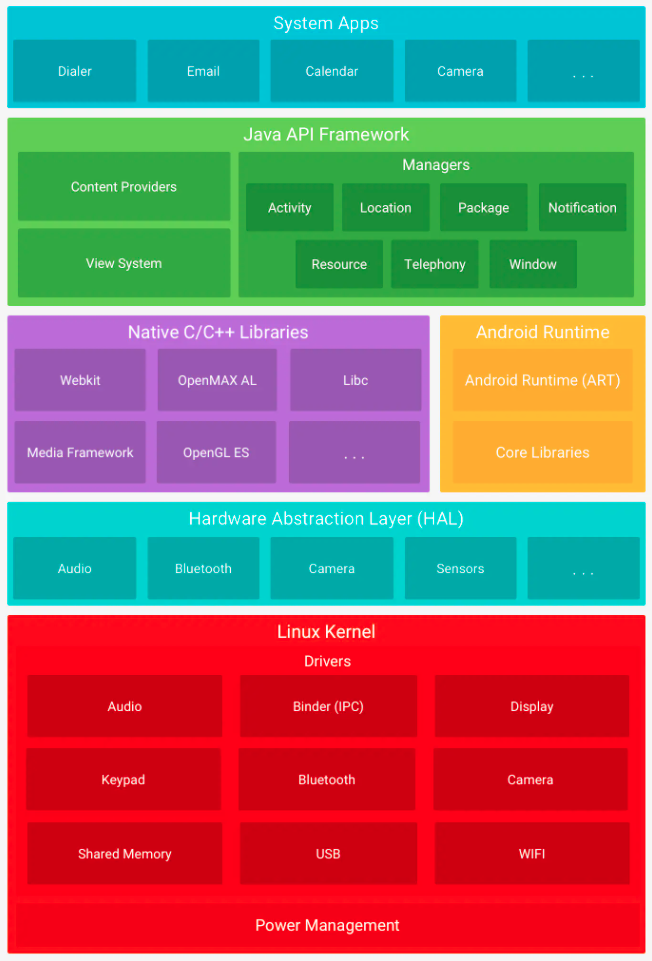
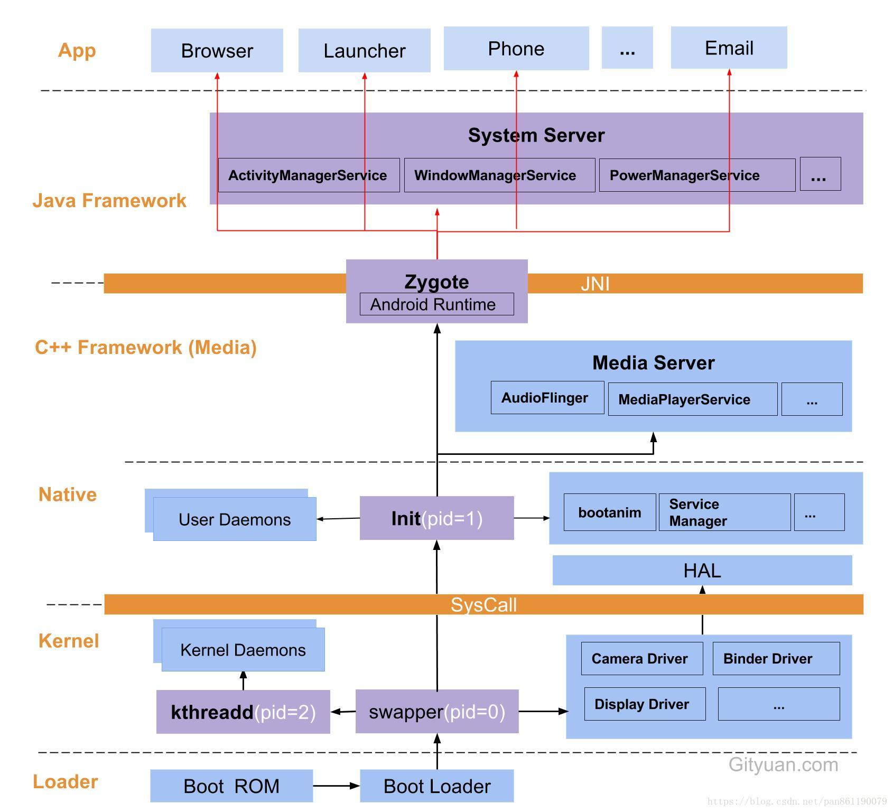

## Android系统启动过程

[TOC]

### 1. Android系统介绍

​	Android采用分层的架构模型，分为四层，分别是**应用程序层(app+System apps)、应用程序框架层(Framework)、系统运行库和运行环境层(Libraries+runtime)、Linux内核层(HAL+LinuxKernel),**如下图所示：

- Linux核心层

  linux内核：平台的基础，直接和硬件打交道。硬件驱动、进程管理、内存管理、网络管理的功能都在这里实现。

  硬件抽象层：为上层的JavaAPIFramework提供相关的硬件显示功能，audio,camera,sensors是硬件抽象层的库模块。

- 系统运行库和运行环境

  运行环境：5.0之前是Dalvik虚拟机，之后被ART替代。基于寄存器(区别：Jvm基于栈)，运行dex文件。

  库文件：原生的C/C++库，如webkit、OpenGL。

- 应用程序框架层

- Application层

### 2. 系统启动过程

可以看到：Android系统启动是一个从下往上的启动过程： `Loader`->`Kernel`->`Native`->`Framework`->`app`。

#### Loader层

- `Boot Rom`：长按开机键开机，引导芯片开始从固化在`Rom`里预设的代码开始执行，然后加载引导程序到`Ram`。
- `Boot Loader`：这是启动`Android`系统之前的引导程序，主要是检查`Ram`、初始化参数等功能。

#### Kernel层

kernel层是Android内核层，到这里才刚刚进入Android系统。

1. 启动`Kernel`层的`swapper`进程（pid=1），系统初始化过程Kernel创建的第一个进程，用于初始化进程管理、内存管理，加载`Display`、`Camera`、`Binder`等驱动相关工作。
2. 启动`kthreadd`（pid=2），这是`Linux`系统的内核进程，会创建内核工作线程`kworkder`、软中断线程`ksoftirqd`和`thermal`等内核守护进程。`kthreadd`是所有内核进程的鼻祖。

#### Native层

这里的`Native`层主要包括`init`孵化来的用户空间的守护进程、HAL层及开机动画等。启动`init`进程（pid=1），是`Linux`系统的用户进程，**init进程是所有用户进程的鼻祖。！！！**

- `init`进程会孵化出`ueventd`、`logd`、`healthd`、`installd`、`adbd`、`lmkd`等用户守护进程；
- `init`进程还会启动`ServiceManager`（Binder服务管家）、`bootanim`（开机动画）等重要服务。
- `init`进程孵化出`Zygote`进程，`Zygote`进程是Android系统第一个`Java`进程（虚拟机进程），**zygote进程是所有Java进程的父进程。！！！**

#### Framework层

framework层主要**包括`Zygote进程`、`SystemServer进程`和MediaService进程。**

##### 1. Zygote进程

`Zygote`进程是由`init`进程通过解析`init.rc`文件后`fork`生成的。`Zygote`的任务主要包括：

1. 加载`ZygoteInit`类，注册`Zygote Socket`服务端套接字。
2. 加载虚拟机
3. `preloadClassses`
4. `preloadResources`

##### 2. SystemServer进程

`System Server`进程是由`Zygote`进程`fork`而来，**System Server是Zygote孵化的第一个进程**。`System Server`负责启动和管理整个`Java Framework`，包含`ActivityManager`、`PowerManager`等服务。

##### 3. MediaServer进程

`Media Server` 进程由`init`进程`fork`而来，负责管理整个`C++ Framework`，包含`AudioFlinger`、`Camera Service`等服务。

#### App层

`Zygote`进程孵化出的第一个`App`进程是`Launcher`，也就是用户看到的`桌面App`。同时`Zygote`进程还会创建`Browser`、`Phone`、`Email`等`App`进程。也就是说**所有的App进程都是由Zygote进程fork生成的。**

#### Syscall和JNI

`Native`层和`Kernel`层有一个系统调用层，也就是Syscall。`Java`层和`native`层之间的纽带是`JNI`。

#### 名词解释

| 类名                   | 作用                                                         |
| ---------------------- | ------------------------------------------------------------ |
| **Init进程**           | 系统内核启动完成后，就会创建用户空间的第一个进程；后面所有的进程，都是它孵化出来的。 |
| **Zygote进程**         | 是系统创建新进场的核心，在init进程启动后就会创建zygote进程；zygote进程在内部会先启动Dalvik虚拟机，继而加载一些必要的系统资源和系统类，最后进入一种监听状态。在之后的运作中，当其他系统模块（比如AMS）希望创建新进程时，只需向zygote进程发出请求，zygote进程监听到该请求后，会相应地fork出新的进程，于是这个新进程在初生之时，就先天具有了自己的Dalvik虚拟机以及系统资源 |
| **SystemServer进程**   | 并称**Android世界的三极。**SS是由Zygote通过Zygote.forkSystemServer函数fork诞生出来的。与Zygote生死与共.SS诞生后,便和生父Zygote分道扬镳,它有了自己的历史使命。即加载各种Service()。 作用: init1()是native函数,启动了 c++运行时库,如：sqllite,OpenGL ES等,然后把调用线程加入Binder通信中。 init2在Java层,就是单独创建一个线程,用以启动系统各项服务,如：ActivityManagerService,PowerManagerService...注意这些服务都是线程,在SystemServer进程中. |
| **AcitvityThread**     | 它的main方法，是整个应用程序的入口，管理者四大组件。ActivityThread主要用来和AMS通讯的客户端。 |
| **ServiceManager进程** | Binder服务管家或叫路由。                                     |
| ActivityManagerService | 简称AMS，它是android中很重要的一个服务，它统筹管理着android的四大组件；统一调度各应用进程。 |
| WMS                    | 控制所有Window的显示与隐藏以及要显示的位置. **既然每个窗口都有一块Surface供自己涂鸦，必然需要一个角色对所有窗口的Surface进行协调管理。于是，WMS便应运而生。WMS为所有窗口分配Surface，掌管Surface的显示顺序（Z-order）以及位置尺寸，控制窗口动画，并且还是输入系统的一重要的中转站。** |
| PMS                    | 1、提供一个应用程序的所有信息（ApplicationInfo） 2、提供四大组件的信息。 3、查询permission相关信息。 4、提供包的信息。 5、安装、卸载APK。 |

