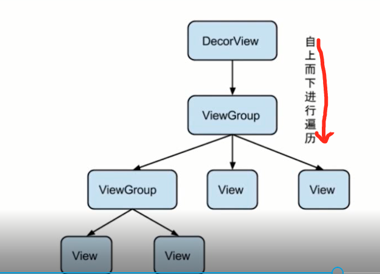

### View绘制流程

[TOC]

#### 1.  View绘制的起点

​	ViewRootImpl类的`requestLayout()`方法。

```java
@Override
public void requestLayout() {
  if (!mHandlingLayoutInLayoutRequest) {
    // 检查发起布局请求的线程是否为主线程  
    checkThread();
    mLayoutRequested = true;
    scheduleTraversals();
  }
}
```


#### 2. 三个阶段

View的整个绘制流程可以分为以下三个阶段：

- measure: 判断是否需要重新计算View的大小，需要的话则计算；
- layout: 判断是否需要重新计算View的位置，需要的话则计算；
- draw: 判断是否需要重新绘制View，需要的话则重绘制。
  这三个子阶段可以用下图来描述：



##### measure阶段


##### layout阶段


##### draw阶段