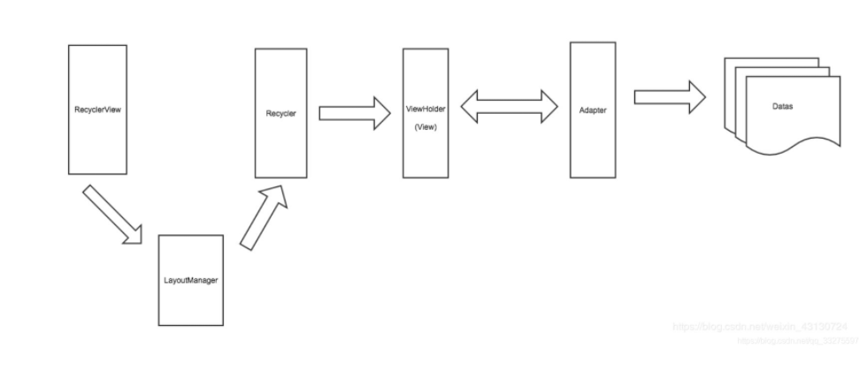

## RecycleView机制

[TOC]

### 一、介绍

​	[参考](https://blog.csdn.net/qq_33275597/article/details/93849695)

​	RecyclerView的职责就是将Datas中的数据以一定的规则展示在它的上面，但说破天RecyclerView只是一个ViewGroup，它只认识View，不清楚Data数据的具体结构，所以两个陌生人之间想构建通话，我们很容易想到适配器模式，因此，RecyclerView需要一个Adapter来与Datas进行交流：

​	但RecyclerView是个很懒惰的人，尽管Adapter已经将Datas转换为RecyclerView所熟知的View，但RecyclerView并不想自己管理些子View，因此，它雇佣了一个叫做LayoutManager的大祭司来帮其完成布局:

​	如上图所示，LayoutManager协助RecyclerView来完成布局。但LayoutManager这个大祭司也有弱点，就是它只知道如何将一个一个的View布局在RecyclerView上，但它并不懂得如何管理这些View，如果大祭司肆无忌惮的玩弄View的话肯定会出事情。

所以，必须有个管理View的护法，它就是Recycler，LayoutManager在需要View的时候回向护法进行索取，当LayoutManager不需要View(试图滑出)的时候，就直接将废弃的View丢给Recycler，图示如下

**LayoutManager：**接管RecyclerView的Measure，Layout，Draw的过程

**Recycler：**缓存池

**Adapter：**ViewHolder的生成器和内容绑定器。



```java
public class RecyclerView extends ViewGroup implements ScrollingView{
	    final Recycler mRecycler = new Recycler();

  		// 管理废弃的View和便于重用
  		public final class Recycler {
        final ArrayList<ViewHolder> mAttachedScrap = new ArrayList<>();
        ArrayList<ViewHolder> mChangedScrap = null;

        final ArrayList<ViewHolder> mCachedViews = new ArrayList<ViewHolder>();

        private final List<ViewHolder>
                mUnmodifiableAttachedScrap = Collections.unmodifiableList(mAttachedScrap);

        private int mRequestedCacheMax = DEFAULT_CACHE_SIZE;
        int mViewCacheMax = DEFAULT_CACHE_SIZE;

        RecycledViewPool mRecyclerPool;

        private ViewCacheExtension mViewCacheExtension;
       	...
       }
		...
}
```

### 二、缓存原理

[参考](https://blog.csdn.net/weishenhong/article/details/81844514)

**绘制过程简介：**

1. RecyclerView.requestLayout开始发生绘制，忽略Measure的过程
2. 在Layout的过程会通过LayoutManager.fill去将RecyclerView填满
3. LayoutManager.fill会调用LayoutManager.layoutChunk去生成一个具体的ViewHolder
4. 然后LayoutManager就会调用Recycler.getViewForPosition向Recycler去要ViewHolder
5. Recycler首先去一级缓存（Cache）里面查找是否命中，如果命中直接返回。如果一级缓存没有找到，则去三级缓存查找，如果三级缓存找到了则调用Adapter.bindViewHolder来绑定内容，然后返回。如果三级缓存没有找到，那么就通过Adapter.createViewHolder创建一个ViewHolder，然后调用Adapter.bindViewHolder绑定其内容，然后返回为Recycler。【参见后文：2. 缓存机制】
6. 一直重复步骤3-5，知道创建的ViewHolder填满了整个RecyclerView为止。


### 三、 与ListView区别

[参考](https://www.cnblogs.com/chen-ying/p/12386712.html)

1. RecycleView 适配了不同的UI布局显示(横向纵向网格)
2. RecycleView框架设计和缓存机制优化了。
3. 支持局部刷新、动画效果、分割线等特性。