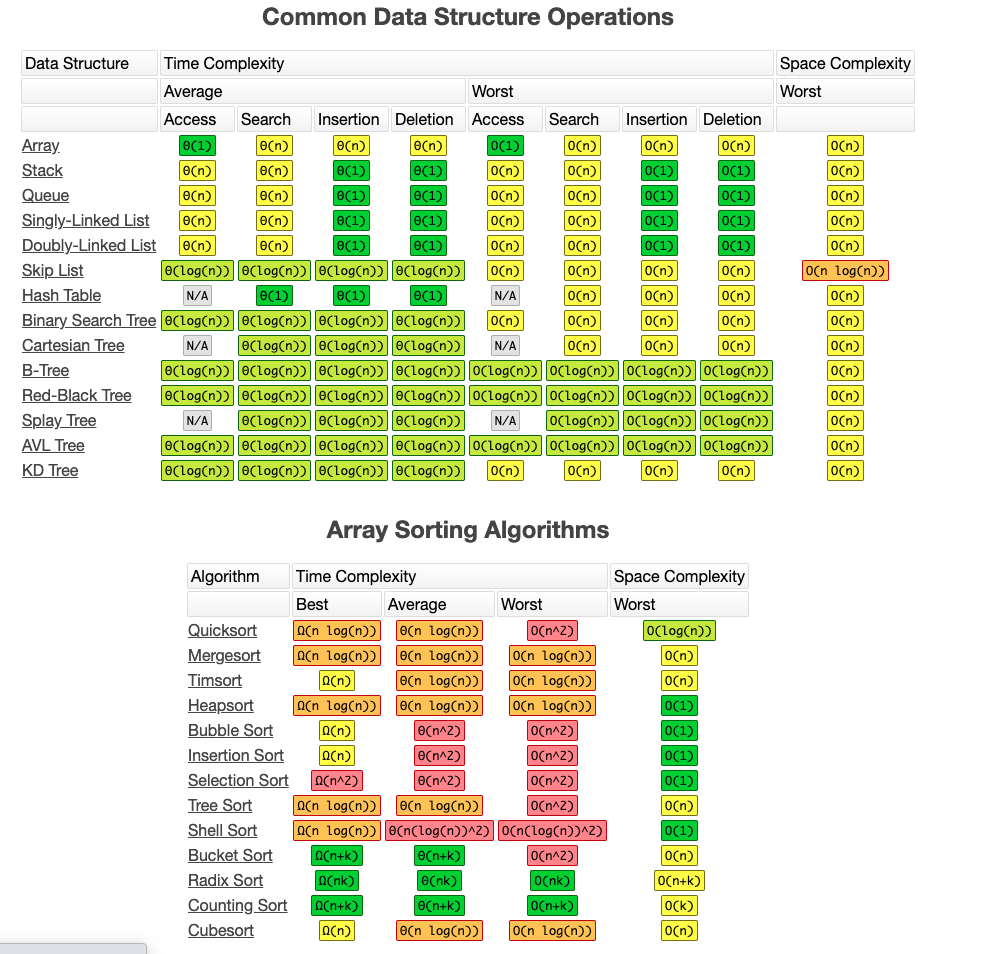

## 算法和数据结构

[TOC]

> 一般按照数据的逻辑结构分为线性结构(一对一)和非线性结构(多对多)。常用线性结构有：一维数组、栈、队里、串等；非线性结构：多维数组、广义表、树、图等。


### 1. 概述

 1. **概念**

    ​	数据结构指的是“一组数据的存储结构”，算法指的是“操作数据的一组方法”。

    数据结构是为算法服务的，算法是要作用在特定的数据结构上的。

 2. **常用数据结构和算法**

- 数据结构：数组、栈、队列、优先队列、堆、链表、散列表、二叉树、跳表、图、Tire树等。
- 算法：递归、排序、二分查找、搜索、哈希算法、贪心算法、分治算法、回溯算法、动态规划、字符串匹配算法等。

 3. **复杂度**

    包括： O(1)（常数阶）、O(logn)（对数阶）、O(n)（线性阶）、O(nlogn)（线性对数阶）、O(n^2)（平方阶）、O(n^3)（立方阶）、O(2^n)（指数阶）、O(n!)（阶乘阶）。

    

    

 4. 。。

### 1. 数学概念

##### 1. 运算操作符

**针对二进制：**

| 符号 | 名称       | 说明                                           |
| :--- | :--------- | :--------------------------------------------- |
| &    | 与         | 全为1则为1，否则为0。 2&3=2                    |
| \|   | 或         | 全为0则为0，否则为1。 2&3=3                    |
| ^    | 异或       | 相同为0，不同为1。       2^3=1                 |
| <<   | 向左移位   | 向左移动，后面补0。     2<<3 = 2 * $2^3$ = 16  |
| >>   | 向右移位   | 向右移动，前面补0。     2>>3 = 0,-16>>2=14     |
| >>>  | 无符号右移 | 向右移动，前面补0。    16>>>2=8,-16>>>2=107... |

##### 2. 数学知识

1. 等差数列

   1+2+3+4+...+n = n(n+1)/2

2. 指数

   指数函数：。

   指数是幂运算aⁿ(a≠0)中的一个参数，a为底数，n为指数。

   

3. 对数

   对数函数：

   

   ，即*a*的*x*次方等于*N*（*a*>0，且*a*≠1），那么**数*x*叫做以*a*为底*N*的对数（logarithm）**，记作

   

   。其中，*a*叫做对数的[底数](https://baike.baidu.com/item/底数)，*N*叫做[真数](https://baike.baidu.com/item/真数/20402544)，*x*叫做“以*a*为底*N*的**对数**”。

   ```java
     /**
       * 自然底数：对于数列{ ( 1 + 1/n )^n }，
       *当n趋于正无穷时该数列所取得的极限就是e，即e = lim (1+1/n)^n。 
       */
      	public static final double E = 2.7182818284590452354;
   
       /**
        * 圆周率：pi= 周长/直径
        */
       public static final double PI = 3.14159265358979323846;
   
    System.out.println(Math.log(10)); // 2.302
    System.out.println(log(8,2)); // 3
    System.out.println(log(100,10)); // 10
   ```

   数学上指数和对数是一对互逆运算。

