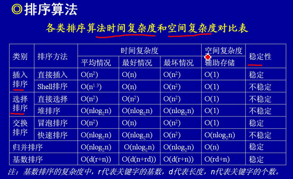

### 排序算法



> 当n较大，则应采用时间复杂度为O(nlog2n)的排序方法：快速排序、堆排序或归并排序序。

#### 1. 快速排序

是目前基于比较的内部排序中被认为是最好的方法，当待排序的关键字是**随机分布时**，快速排序的平均时间最短。

**思想：**快速排序法的基本精神是在数列中找出适当的轴心，然后将数列一分为二(左边都小于等于轴心值，右边大于轴心值)，然后分别对左边与右边数列进行排序。

**复杂度：**O(NlogN)，O(NlogN)。

```java
// 快速排序算法(从小到大)
    public static void quickSort(int[] nums, int begin, int end) {
        int middle = nums[begin];
        int left = begin;
        int right = end;

        if (begin < end) {
            return;
        }

        while (left < right) {
            while (left < right && nums[right] > middle) {
                right--;
            }
            nums[left] = nums[right];

            // 注意等号
            while (left < right && nums[left] <= middle) {
                left++;
            }
            nums[right] = nums[left];

            System.out.println(left + "  " + right);
        }

        nums[left] = middle;

        quickSort(nums, begin, left - 1);
        quickSort(nums, right + 1, end);
    }
```

#### 2. 冒泡排序

**思想：** 通过一趟排序，将数组中最大元素移动到最后一个位置，然后继续排第二大元素到倒数第二个位置**（外层循环n-1,内存循环n-1-i）**。

**复杂度:**O(n^2)，O(1)。

```java
public static void sortBubble(int[] nums){
  for (int i=0;i<nums.length-1;i++){
    for (int j=0;j<nums.length-1-i;j++){
      if(nums[j] > nums[j+1] ){
        swap(nums,j,j+1);
      }
    }
  }
}
```

#### 3. 插入排序

