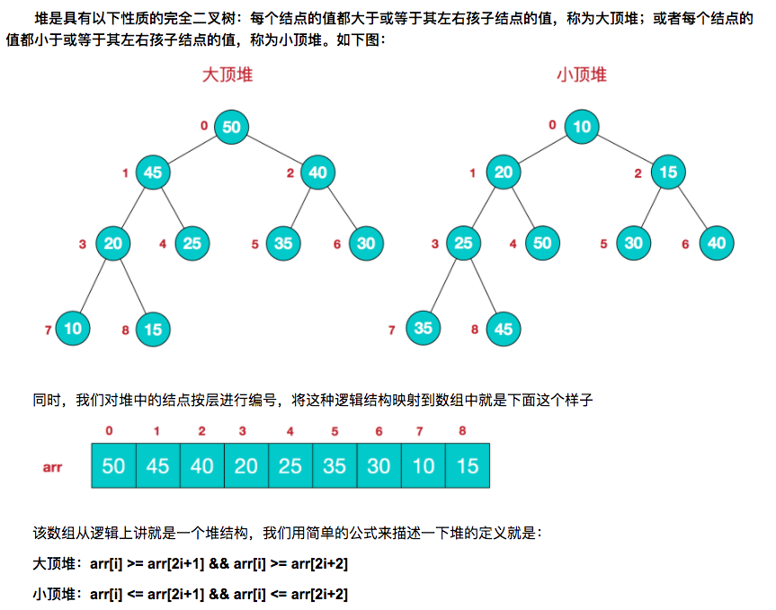

### 排序算法

[TOC]


> 当n较大，则应采用时间复杂度为O(nlog2n)的排序方法：快速排序、堆排序或归并排序序。

#### 口诀和区别

​	牢记思想最重要，速度最快快归堆，数据序少选插入；

​	快排先选个基数，小于放左，大于右；

​	冒泡大泡放后边，外层循环n-1,内层选好n-1-i;

​	插排放入有序中，直排遍历最小值；

​	堆排搞搞大顶堆，归并先分后合并。

​	**使用场景：**	

​	O(NlogN)：快排适合数据分散的数据；归并排、堆排适合大量数据；

​	O(N^2)：数据量小选插入(大部分有序最好)，数据量大冒泡最差。

​	稳定性：插排、冒泡、归并 为稳定，其他为不稳定。

#### 1. 快速排序

**适用场景：**是目前基于比较的内部排序中被认为是最好的方法，当待排序的关键字是**随机分布时**，快速排序的平均时间最短。

**思想：**快速排序法的基本精神是在数列中找出适当的轴心，然后将数列一分为二(左边都小于等于轴心值，右边大于轴心值)，然后分别对左边与右边数列进行排序。

**复杂度：**O(NlogN)，O(NlogN)。

```java
	 /**
     * 快速排序(NLogN)
     * 思想： 找个基准值，小于它的放左边，大于它的放右边，依次左右两边数据再进行上述操作。
     * 实现： 1. 递归遍历(array,left,right) 2. wihle依次循环(右边小值放左边，左边大值放右边，交错执行) 3. 中间值赋值
     */
    public static void quickSort(int[] nums, int left, int right) {
        if (left > right) {
            return;
        }
        int value = nums[left];// 目标值

        while (left < right) {

            while (left < right && nums[right] > value) {
                right--;
            }
            nums[left] = nums[right];

            while (left < right && nums[left] <= value) {
                left++;
            }

            nums[right] = nums[left];
        }

        nums[left] = value;

        quickSort(nums, 0, left - 1);
        quickSort(nums, left + 1, right);
    }
```

#### 2. 冒泡排序

**适用场景：**任何。

**思想：** 通过一趟排序，将数组中最大元素移动到最后一个位置，然后继续排第二大元素到倒数第二个位置**（外层循环n-1,内存循环n-1-i）**。

**复杂度:**O(n^2)，O(1)。

```java
	 /**
     * 冒泡排序(n^2)
     * 思想：挨个交换，把最大值放最后。
     * 实现：外层循环n-1,内存循环n-1-i。
     */
    public static void bubbleSort(int[] nums) {
        for (int i = 0; i < nums.length - 1; i++) {
            for (int j = 0; j < nums.length - 1 - i; j++) {
                if (nums[j] > nums[j + 1]) {
                    swap(nums, j + 1, j);
                }
            }
        }
    }
```

#### 3. 直接插入

**适用场景：** 少量数据，最好有部分是有序的(有序数组O(n)，逆序数组O(n^2))。

**思想：** 在一个有序的数组中为要插入的元素找到指定的插入位置，但这个位置并不一定是最后排序结果中对应元素的最终位置。。

**复杂度:**O(n^2)，O(1)。

```java
   /**
     * 直接插入(n^2,有序场景最好)
     * 思想：维护一个有序数组，依次向有序数组插入值。
     */
    public static void insertSort(int[] nums) {
        for (int i = 0; i < nums.length; i++) {

            for (int j = 1; j < nums.length; j++) {
                while (j > 0 && nums[j] < nums[j - 1]) {
                    swap(nums, j, j - 1);
                    j--;
                }
            }

        }
    }

```

#### 4. 直接选择

**适用场景：** 开始就有序。

**思想：** 从最小一个元素开始，以此选择放入。数组分成有序区和无序区，初始时整个数组都是无序区，然后每次从无序区选一个最小的元素直接放到有序区的最后，直到整个数组变有序区。

**复杂度:**O(n^2)，O(1)。

初始关键字：『 **8**，5，2，6，9，3，1，4，**0**，7 』

 第一趟排序后：0，『**5**，2，6，9，3，**1**，4，8，7』

 第二趟排序后：0，1，『**2**，6，9，3，5，4，8，7』

 第三趟排序后：0，1，2，『**6**，9，**3**，5，4，8，7』

 第四趟排序后：0，1，2，3，『**9**，6，5，**4**，8，7』 ...

```java
    /**
     * 直接选择(n^2,有序场景最好)
     * 思想：每次找到一个最小值，依次找完。
     */
    public static void selectSort(int[] nums) {
        for (int i = 0; i < nums.length; i++) {

            int minIndex = i;
            for (int j = i + 1; j < nums.length; j++) {
                if (nums[j] < nums[minIndex]) {
                    minIndex = j;
                }

            }
            swap(nums, i, minIndex);
        }

    }
```

#### 5. 堆排序

**适用场景：**任何。

**思想：**堆排序是利用**堆(大顶堆)**这种数据结构而设计的一种排序算法，堆排序是一种**选择排序，**它的最坏，最好，平均时间复杂度均为O(nlogn)，它也是不稳定排序。**堆排序的基本思想是：将待排序序列构造成一个大顶堆，此时，整个序列的最大值就是堆顶的根节点。将其与末尾元素进行交换，此时末尾就为最大值。然后将剩余n-1个元素重新构造成一个堆，这样会得到n个元素的次小值。如此反复执行，便能得到一个有序序列了**



[参考](https://www.cnblogs.com/chengxiao/p/6129630.html)

#### 6. 归并排序

**适用场景：**任何。

**思想：** 分治法思想(自上而下递归，自下而上迭代)。

[参考](https://www.jianshu.com/p/33cffa1ce613)

