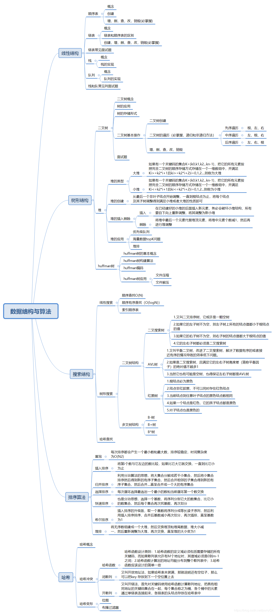

### 算法和数据结构

[TOC]

> 一般按照数据的逻辑结构分为线性结构(一对一)和非线性结构(多对多)。常用线性结构有：一维数组、栈、队里、串等；非线性结构：多维数组、广义表、数、图等。

#### 二叉树

##### 分类

- 二叉树

  特点：每个节点最多有两个子树。

- 满二叉树

  特点：除叶子节点外，其他节点的度一定是2。

- 完全二叉树

  特点：叶子节点可以为一个；满二叉树一定是完全二叉树。

- 二叉查找树&二叉排序树

  特点：左子树上的节点均小于根节点，右子树上的节点均大于根节点。

- 平衡二叉树

  特点： 是对二叉查找树的优化；避免二叉查找树变成“链表”，保证树的左右平衡。

- 红黑树

  特点：**从根到叶子的最长的可能路径不多于最短的可能路径的两倍长**

  **区别：** 

  1、红黑树放弃了追求完全平衡，追求大致平衡，在与平衡二叉树的时间复杂度相差不大的情况下，保证每次插入最多只需要三次旋转就能达到平衡，实现起来也更为简单。

  2、平衡二叉树追求绝对平衡，条件比较苛刻，实现起来比较麻烦，每次插入新节点之后需要旋转的次数不能预知。

- 。。