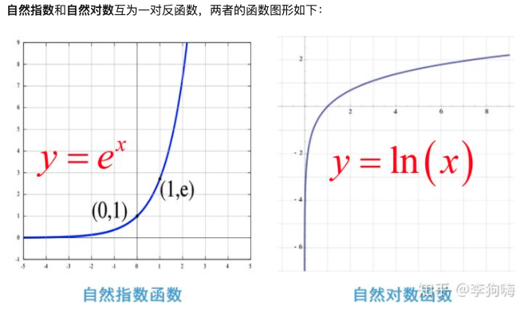
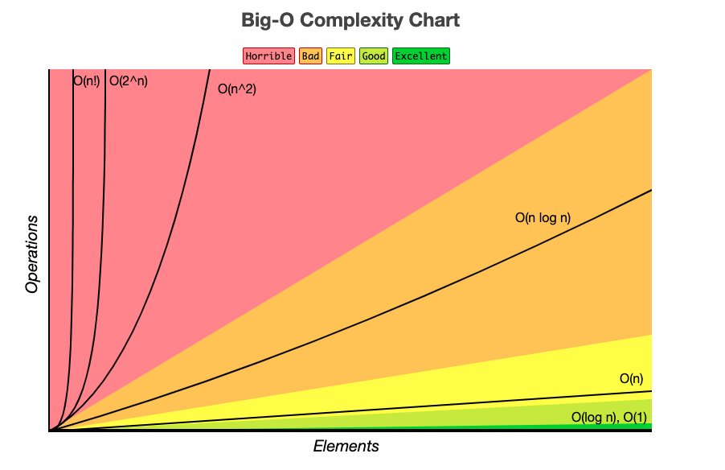
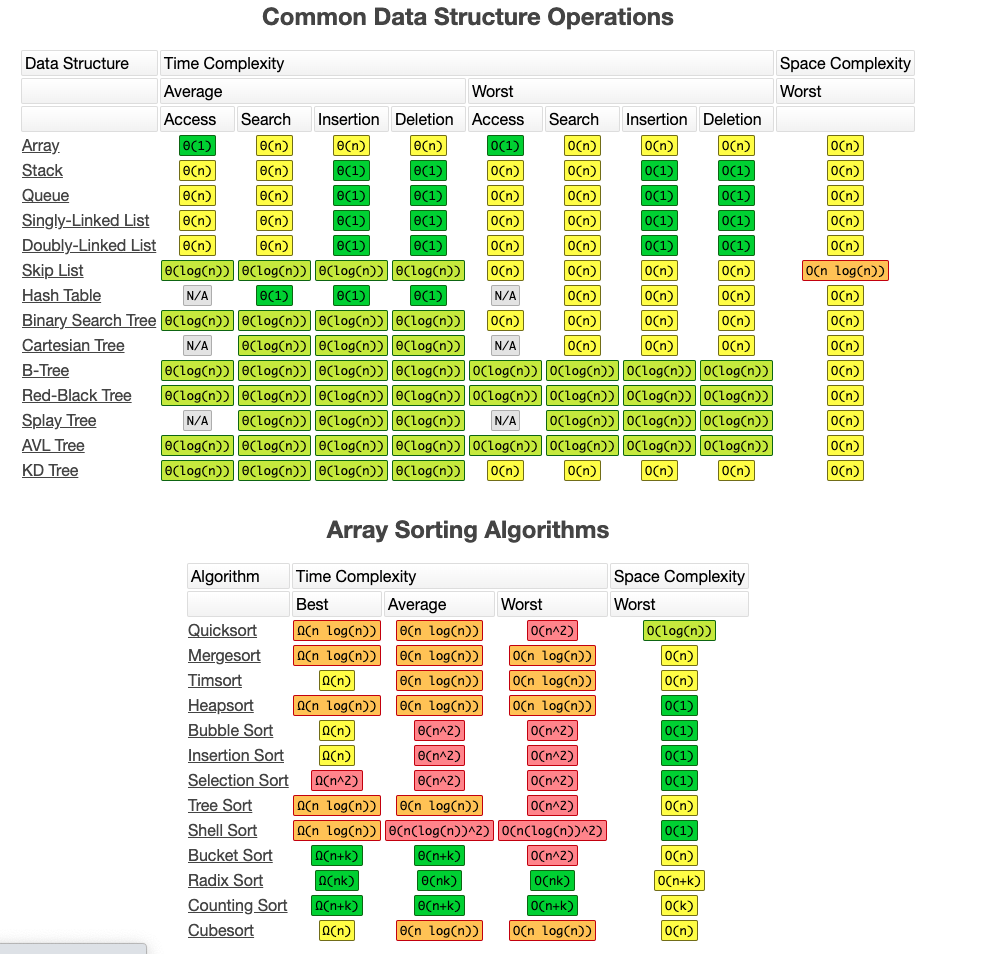

### 算法和数据结构

[TOC]

> 一般按照数据的逻辑结构分为线性结构(一对一)和非线性结构(多对多)。常用线性结构有：一维数组、栈、队里、串等；非线性结构：多维数组、广义表、数、图等。


#### 1. 算法基础

##### 1. 运算操作符

**针对二进制：**

| 符号 | 名称       | 说明                                           |
| :--- | :--------- | :--------------------------------------------- |
| &    | 与         | 全为1则为1，否则为0。 2&3=2                    |
| \|   | 或         | 全为0则为0，否则为1。 2&3=3                    |
| ^    | 异或       | 相同为0，不同为1。       2^3=1                 |
| <<   | 向左移位   | 向左移动，后面补0。     2<<3 = 2 * $2^3$ = 16  |
| >>   | 向右移位   | 向右移动，前面补0。     2>>3 = 0,-16>>2=14     |
| >>>  | 无符号右移 | 向右移动，前面补0。    16>>>2=8,-16>>>2=107... |

##### 2. 数学知识

1. 等差数列

   1+2+3+4+...+n = n(n+1)/2

2. 对数

   在数学中，对数是对求幂的逆运算，

   的逆运算得的的x就是对数。

   如果 

   

   ，即*a*的*x*次方等于*N*（*a*>0，且*a*≠1），那么数*x*叫做以*a*为底*N*的对数（logarithm），记作

   

   。其中，*a*叫做对数的[底数](https://baike.baidu.com/item/底数)，*N*叫做[真数](https://baike.baidu.com/item/真数/20402544)，*x*叫做“以*a*为底*N*的**对数**”。

   ```java
    System.out.println(Math.log(10)); // 2.302
    System.out.println(log(8,2)); // 3
    System.out.println(log(100,10)); // 10
   ```

   

3. 指数

   指数是幂运算aⁿ(a≠0)中的一个参数，a为底数，n为指数。

   

4. ...

#### 2. 复杂度




