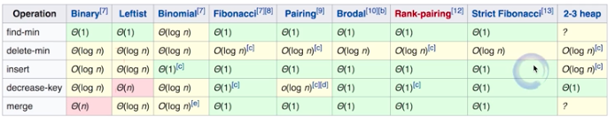

### 算法题1

[TOC]

> 每个题都考察的是一个知识点和解决思路。需要先分析问题数据规律，然后找出难点或复杂点，最后设计解决方法。

#### 1. 查找数组中的重复数字[剑指 Offer 03]

**题目：**

在一个长度为 n 的数组 nums 里的所有数字都在 0～n-1 的范围内。数组中某些数字是重复的，但不知道有几个数字重复了，也不知道每个数字重复了几次。请找出数组中任意一个重复的数字。

`输入：{2, 3, 1, 0, 2, 5, 3}。 输出：2或3。`

**方法(查重)：**

1. 利用HashSet集合

   利用哈希表特性。

   复杂度：O(N)、O(N)。

2. 遍历对比

   暴力破解，遍历依次与前面所有元素对比。

   复杂度：O(n(n+1)/2)，O(1)。

3. 排序

   先快排，再遍历。

   复杂度：O(N$\log$N+N)、O(logN)。

4. 位置交换(把数组视为哈希表)

   利用数组元素特征，`数字num[i]应该放在下标为i的位置上`。

   复杂度：O(N)、O(1)。

   **区别：**1、2不需要需改原数组，3，4需要修改。

```java
//1. 遍历对比
int[] arrays = {2, 3, 1, 0, 2, 5, 3};
jump:for (int i=0;i<arrays.length;i++) {
  int value = arrays[i];
  for (int j=0;j<i;j++){å
    if(value == arrays[j]){
      System.out.println("找到了" + value);
      break jump;
    }
  }
}
//2. 位置交换
int temp;
for (int i=0;i<nums.length;i++){
  if(i == nums[i]){
    continue;
  }

  temp = nums[nums[i]];
  if(temp == nums[i]){
    System.out.println("找到了" + temp);
    break;
  }

  nums[nums[i]] = nums[i];
  nums[i] = temp;
  i--;
}
```

#### 2. 二位数组查找数字(有序)

**`有序`查找思想：**分治思想(二分查找)

> 题目：在一个二维数组中，每一行都按照从左到右递增的顺序排序，每一列都按照从上到下递增的顺序排序。请完成一个函数，输入这样的一个二维数组和一个整数，判断数组中是否含有该整数。

```java
// 一维数组
public int BinarySearch(int[] array,int x,int left,int right){
        while(left<=right){
            int mid=(left+right)/2;
            if(array[mid]==x){
                return mid;
            }
            if(array[mid]>x)right=mid-1;
            else left=mid+1;
        }
        return -1;
    } 
// 二位数组
int[][] arrays = {
                {1, 4, 7, 11, 15},
                {2, 5, 8, 12, 19},
                {3, 6, 9, 16, 22},
                {10, 13, 14, 17, 24},
                {18, 21, 23, 26, 30}
        };
        
int target = 6;
int row = arrays.length;
int col = arrays[0].length;

// 右上角为起点，依次排除行列(分析规律，找对起点)
for (int i=0,j=arrays[0].length-1;(i>=0 && i<row) && (j>=0 && j<col);){
  if(target == arrays[i][j]){
    System.out.println("找到了"+i + " " + j);
    break;
  }else if(target < arrays[i][j]){
    j--;
  }else{
    i++;
  }
}

```

#### 3. 替换空格

**思想：**分析问题复杂点；

```java
// 推荐使用urlecode、replace、StringBuffer解决。
public static void main(String[] args) {
        String test = "We are happy.";
        // 新count
        int newSize = test.length();
        for (int i=0;i< test.length();i++){
            if(test.charAt(i) == ' '){
                newSize +=2;
            }
        }

        // 遍历赋值
        char[] newTest = new char[newSize];
        int tempJumpIndex=0; // 注意索引跳过
        for (int i=0;i< test.length();i++) {
            if(test.charAt(i) == ' '){
                newTest[i+tempJumpIndex] = '%';
                newTest[i+tempJumpIndex+1] = '2';
                newTest[i+tempJumpIndex+2] = '0';
                tempJumpIndex +=2;
            }else {
                newTest[i+tempJumpIndex] =test.charAt(i);
            }
        }

        System.out.println(newTest);
    }
```

#### 4. 反转链表(从尾到头打印)

```java
// 1. 思想：头插入法
public static Node reverseByInsert(Node headNode){
        Node temp;
        Node newHead = null;
        while (headNode != null){
            temp = headNode;
            headNode = headNode.next;
            
            temp.next = newHead;
            newHead = temp;
        }
        return newHead;
}
或
public static Node reverseByInsert(Node head) {
        if (head == null || head.next == null) { return head;}
        Node prev, cur, end;
        prev = null;
        cur = head;
        end = head.next;
				// 遍历生成pre
        while (cur != null) {
            cur.next = prev;

            prev = cur;
            cur = end;
            if (end != null) {
                end = end.next;
            }
        }
        return prev;
}  
// 2. 就地反转
public static Node reverseByLocal(Node head) {
       Node cur = head;
       Node next = cur.next;

        Node temp;
        while (next != null){
           temp = next.next;
           next.next = cur;
           cur = next;
           next = temp;
       }

       head.next = null;
       head = cur;
       return head;
}
// 3. 思想：递归到尾部，依次翻转断链
public static Node reverse(Node headNode){
        if(headNode == null || headNode.next == null){
            return headNode;
        }

        Node newNode = reverse(headNode.next);
        headNode.next.next = headNode;  // node翻转
        headNode.next = null;           // 断链
        return newNode;
}
```

[leetcode](https://leetcode-cn.com/problems/reverse-linked-list)

#### 5. 两两交换链表中的节点

[leetcode](https://leetcode-cn.com/problems/swap-nodes-in-pairs/)

#### 6. 判断链表是否有环

[leetcode](https://leetcode-cn.com/problems/linked-list-cycle/)

#### 7. 字符串合法检查("({[]})")

栈实现

#### 8. 用栈实现队列

#### 9. 用队里实现栈

堆实现、二叉搜索树实现。

#### 10. 优先队列

堆实现：二叉堆(jdk默认小顶堆实现PriorityQueue)、斐波拉契堆(效率最高)等。

堆实现区别：



#### 11. 数据流中第K大元素

PriorityQueue

#### 12. 滑动窗口最大值(239)

解法：MaxHeap(优先队列)、Deque(ArrayDeque双端队列，最优解法)

#### 13. 有效的字母异位词(242)

解法：hashmap.

#### 14. 树、二叉树、二叉搜索树

**Linked List 就是特殊化的树；Tree就是特殊化的Graph(图)。**

**二叉搜索树(Binary Search Tree)，O(logn)**，也称有序二叉树(ordered binary tree)，排序二叉树(sorted binary tree)，特性： 左子树上的节点的值均小于它的根节点的值，反之，左右子树也是二叉查找树。

**红黑树：**是一种自平衡二叉查找树，这些约束强制了红黑树的关键性质: 从根到叶子的最长的可能路径不多于最短的可能路径的两倍长。结果是这个树大致上是平衡的。因为操作比如插入、删除和查找某个值的最坏情况时间都要求与树的高度成比例，这个在高度上的理论上限允许红黑树在最坏情况下都是高效的，而不同于普通的二叉查找树。


- 参考

[1. leetcode](https://leetcode-cn.com/problemset/lcof/)

[2. big-O](https://www.bigocheatsheet.com/)