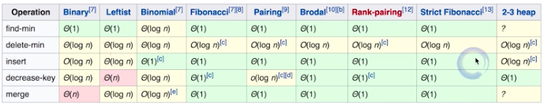
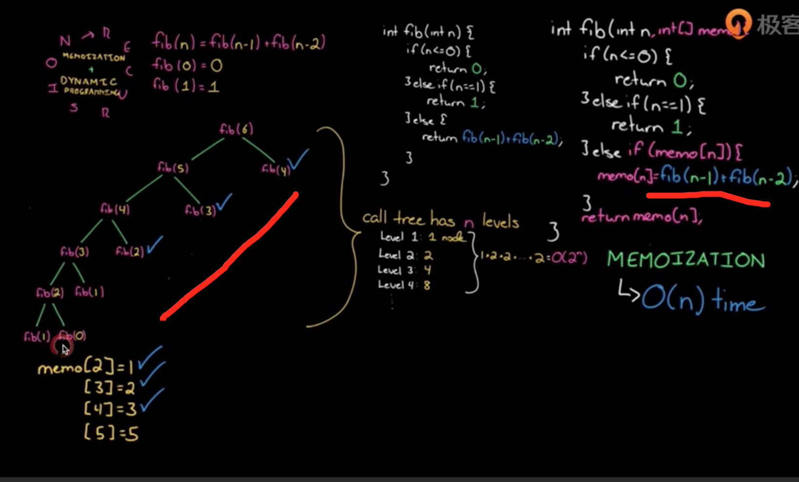

### 算法面试题-基础

[TOC]

[文章1](https://leetcode-cn.com/circle/discuss/AfJAq7/)

[文章2](https://www.jianshu.com/p/c70989bd5f29)

[文章3](https://www.jianshu.com/p/b08413d5bdb5)

[文章4](https://www.sohu.com/a/256897604_100231250)

[文章5](https://leetcode-cn.com/circle/discuss/CdPmqz/)

> 注意事项：
>
> 	1. 持续练习、精深练习。
>  	2. 切题四件套。
>  	3. 沟通和交流很重要。

#### 一、综合题目

##### 1. 查找数组中的重复数字

**[题目内容](https://leetcode-cn.com/problems/shu-zu-zhong-zhong-fu-de-shu-zi-lcof/)**

**思路(查重复)：**

1. 利用HashSet集合

   利用哈希表特性。

   复杂度：O(N)、O(N)。

2. 遍历对比

   暴力破解，遍历依次与前面所有元素对比。

   复杂度：O(n(n+1)/2约等于n^2)，O(1)。

3. 排序

   先快排，再遍历。

   复杂度：O(N$\log$N+N约等于NLogN)、O(logN)。

4. 原地置换(抽屉原理) **最优解**

   利用数组元素特征，`数字num[i]应该放在下标为i的位置上`。

   复杂度：O(N)、O(1)。

   **区别：**1、2不需要需改原数组，3，4需要修改。

```java
//1. 遍历对比
int[] arrays = {2, 3, 1, 0, 2, 5, 3};
jump:for (int i=0;i<arrays.length;i++) {
  int value = arrays[i];
  for (int j=0;j<i;j++){å
    if(value == arrays[j]){
      System.out.println("找到了" + value);
      break jump;
    }
  }
}
//2. 位置交换
int temp;
for (int i=0;i<nums.length;i++){
  if(i == nums[i]){
    continue;
  }

  temp = nums[nums[i]];
  if(temp == nums[i]){
    System.out.println("找到了" + temp);
    break;
  }

  nums[nums[i]] = nums[i];
  nums[i] = temp;
  i--;
}
//3. 快排
```

##### 2. 在排序数组中查找数字I出现的次数

**[题目内容](https://leetcode-cn.com/problems/zai-pai-xu-shu-zu-zhong-cha-zhao-shu-zi-lcof/)**

**思路(查重复、二分)：**

1. 二分查找，左右分别查找。

   时间复杂度O(NlogN+N约等于NlogN)，空间复杂度O(logN)。

```java
 public static int findNumberInArrayRepeat(int[] nums, int number, int left, int right) {
        int valueIndex = binarySearch(nums, 0, left, right);

        int repeatNumber = 0;
        if (valueIndex == -1) {
            return repeatNumber;
        }

        for (int i = valueIndex; i >= 0; i--) {
            if (nums[i] == number) {
                repeatNumber++;
                continue;
            }
            break;
        }

        for (int i = valueIndex + 1; i < nums.length; i++) {
            if (nums[i] == number) {
                repeatNumber++;
                continue;
            }
            break;
        }

        return repeatNumber;
    }

		// 二分查找元素索引
    public static int binarySearch(int[] nums, int target) {
        int left = 0;
        int right = nums.length - 1; // 注意

        while (left <= right) { // 注意
            int mid = (right + left) / 2;
            if (nums[mid] == target)
                return mid;
            else if (nums[mid] < target)
                left = mid + 1; // 注意
            else if (nums[mid] > target)
                right = mid - 1; // 注意
        }
        return -1;
    }
```

##### 3. 二维数组的查找

**[题目内容](https://leetcode-cn.com/problems/er-wei-shu-zu-zhong-de-cha-zhao-lcof/)**

**思路(找规律)：**

1. 右上角元素 大于左边值，小于下边值(或右下角)。

   时间复杂度O(n+m)，空间复杂度O(1)。

2. 暴力循环，全部遍历。

   时间复杂度O(n*m)，空间复杂度O(1)。

3. 二分+列循环。

   遍历比较找每一行最大值，找到target小于最大值的一行；

   二分遍历该行，找到相邻的比target小的元素Index;

   从该行开始，按列遍历比较Index的元素，直到匹配成功。

   时间复杂度大概是O(logN+M或N+logM);

```java
// 二位数组
int[][] arrays = {
                {1, 4, 7, 11, 15},
                {2, 5, 8, 12, 19},
                {3, 6, 9, 16, 22},
                {10, 13, 14, 17, 24},
                {18, 21, 23, 26, 30}
        };
        
int target = 6;
int row = arrays.length;
int col = arrays[0].length;

// 右上角为起点，依次排除行列(分析规律，找对起点)
for (int i=0,j=arrays[0].length-1;(i>=0 && i<row) && (j>=0 && j<col);){
  if(target == arrays[i][j]){
    System.out.println("找到了"+i + " " + j);
    break;
  }else if(target < arrays[i][j]){
    j--;
  }else{
    i++;
  }
}

```

##### 4. 替换空格

**[题目内容](https://leetcode-cn.com/problems/ti-huan-kong-ge-lcof/)**

请实现一个函数，把字符串 `s` 中的每个空格替换成"%20"。

**思路：**

1. 利用replace或split函数或urlencoder直接处理。

   空间复杂度和时间复杂度太高。

2. 遍历，利用StringBuffer拼接数据。

   时间复杂度O(n)，空间复杂度O(n)。

3. 构建一个3倍长度数组(可优化)，遍历即可。

   时间复杂度O(n)，空间复杂度O(3n)。

```java
// 推荐使用urlecode、replace、StringBuffer解决。
public static void main(String[] args) {
        String test = "We are happy.";
        // 新count
        int newSize = test.length();
        for (int i=0;i< test.length();i++){
            if(test.charAt(i) == ' '){
                newSize +=2;
            }
        }

        // 遍历赋值
        char[] newTest = new char[newSize];
        int tempJumpIndex=0; // 注意索引跳过
        for (int i=0;i< test.length();i++) {
            if(test.charAt(i) == ' '){
                newTest[i+tempJumpIndex] = '%';
                newTest[i+tempJumpIndex+1] = '2';
                newTest[i+tempJumpIndex+2] = '0';
                tempJumpIndex +=2;
            }else {
                newTest[i+tempJumpIndex] =test.charAt(i);
            }
        }

        System.out.println(newTest);
    }
```


#### 二、链表

##### 1. 反转链表(从尾到头打印)

```java
// 1. 思想：头插入法
public static Node reverseByInsert(Node headNode){
        Node temp;
        Node newHead = null;
        while (headNode != null){
            temp = headNode;
            headNode = headNode.next;
            
            temp.next = newHead;
            newHead = temp;
        }
        return newHead;
}
或
public static Node reverseByInsert(Node head) {
        if (head == null || head.next == null) { return head;}
        Node prev, cur, end;
        prev = null;
        cur = head;
        end = head.next;
				// 遍历生成pre
        while (cur != null) {
            cur.next = prev;

            prev = cur;
            cur = end;
            if (end != null) {
                end = end.next;
            }
        }
        return prev;
}  
// 2. 就地反转
public static Node reverseByLocal(Node head) {
       Node cur = head;
       Node next = cur.next;

        Node temp;
        while (next != null){
           temp = next.next;
           next.next = cur;
           cur = next;
           next = temp;
       }

       head.next = null;
       head = cur;
       return head;
}
// 3. 思想：递归到尾部，依次翻转断链
public static Node reverse(Node headNode){
        if(headNode == null || headNode.next == null){
            return headNode;
        }

        Node newNode = reverse(headNode.next);
        headNode.next.next = headNode;  // node翻转
        headNode.next = null;           // 断链
        return newNode;
}
```

[leetcode](https://leetcode-cn.com/problems/reverse-linked-list)

##### 2. 两两交换链表中的节点

[leetcode](https://leetcode-cn.com/problems/swap-nodes-in-pairs/)

##### 3. 判断链表是否有环

[leetcode](https://leetcode-cn.com/problems/linked-list-cycle/)


#### 三、堆栈

##### 1. 字符串合法检查("({[]})")

栈实现

##### 2. 用栈实现队列

##### 3. 用队里实现栈

堆实现、二叉搜索树实现。


##### 10. 优先队列

堆实现：二叉堆(jdk默认小顶堆实现PriorityQueue)、斐波拉契堆(效率最高)等。

堆实现区别：



##### 11. 数据流中第K大元素

PriorityQueue

##### 12. 滑动窗口最大值(239)

解法：MaxHeap(优先队列)、Deque(ArrayDeque双端队列，最优解法)

##### 13. 有效的字母异位词(242)

解法：hashmap.

#### 四、树

##### 1. 树、二叉树、二叉搜索树

**Linked List 就是特殊化的树；Tree就是特殊化的Graph(图)。**

**二叉搜索树(Binary Search Tree)，O(logn)**，也称有序二叉树(ordered binary tree)，排序二叉树(sorted binary tree)，特性： 左子树上的节点的值均小于它的根节点的值，反之，左右子树也是二叉查找树。

**红黑树：**是一种自平衡二叉查找树，这些约束强制了红黑树的关键性质: 从根到叶子的最长的可能路径不多于最短的可能路径的两倍长。结果是这个树大致上是平衡的。因为操作比如插入、删除和查找某个值的最坏情况时间都要求与树的高度成比例，这个在高度上的理论上限允许红黑树在最坏情况下都是高效的，而不同于普通的二叉查找树。

##### 2. 验证二叉搜索树

思路： 1. 中序遍历，结果升序数组。 2. 递归，左子树最大值小于root，右子树最小值大于root.


#### 五、经典思想

##### 1. 递归和分治

​	递归：不断调用自身函数，一层一层深入直到终止条件，然后从底层将结果一层一层返回。

​	demo: n的阶乘，斐波拉契算法。

​	分治：将大问题分为一个个不相干的小问题，然后再一次次合并。

​	demo: 排序算法。

##### 2. 广度优先搜索和深度优先搜索

BFS: 按层搜索，人脑思维；

DFS:竖向搜索，然后反向查找漏网之鱼，继续竖向搜索，电脑递归思维。


##### 3. 贪心算法

​	Greedy：在对问题求解时，总是做出在当前看来最好的选择(目光短浅，当前最优，结果不一定最优)。

​	使用场景：简单地说，问题能够分解成子问题解决，**子问题的最优解能递推出最终问题的最优解**。

   说明：

​		贪心算法与动态规划的不同在于它对每个子问题的解决方案都做出选择，不能回退。 动态规划则会保存以前的运算结果，并且根据以前的结果对当前就行选择，有回退功能。

##### 4. 动态规划DP

1. 递归 + 记忆化 -> 递推。
2. 状态的定义：opt[n],dp[n],fib[n]。
3. 状态转移方程：opt[n] = best_of(opt(n-1),opt(n-2),...)。
4. 最优子结构。

- 斐波拉契-递推

  正常斐波拉契时间复杂度为O(2~N)次方。里面用许多重复计算，如果加上缓存记忆，时间复杂度为O(n)。

  

  然后从下往上倒转回去，用动态规划计算如下**(从递归底层开始倒着推导)**：

  ```java
  递归 + 记忆化 ==> 递推 (动态规划的思路)
  递推公式：F(n) = F(n-1) + F(n-2)
  
    F[0] = 0, F[1] = 1;
  	for(int i = 2; i <= n; i++){
      F[i] = F[i-1] + F[i-2];
    }
  ```

  

- 最优路线-递推

  计算从开始走到结束的路线总数(递归实现和上面一样，有大量重复计算)。

  递推公式：opt[i,j] = opt[i-1,j] + opt[i,j-1]。**还是倒着推结果，后面结果形成前面数据，即每一个的结果是下方方格和右方方格路线数目的总和！**

  

- **DP VS 回溯 VS 贪心**
  1. 回溯(递归) - 重复计算
  2. 贪心 - 永远局部最优
  3. DP - 记录局部最优子结构/多种记录值


- 参考

[1. leetcode](https://leetcode-cn.com/problemset/lcof/)

[2. big-O](https://www.bigocheatsheet.com/)