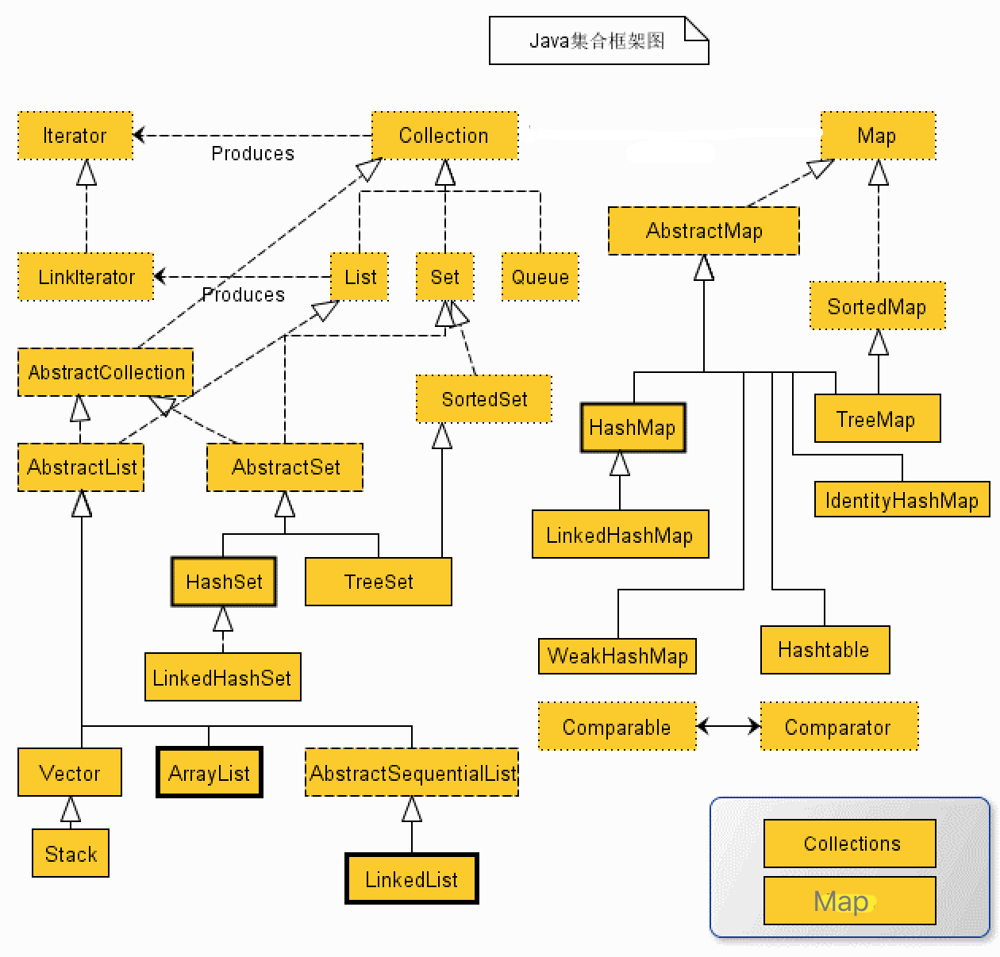
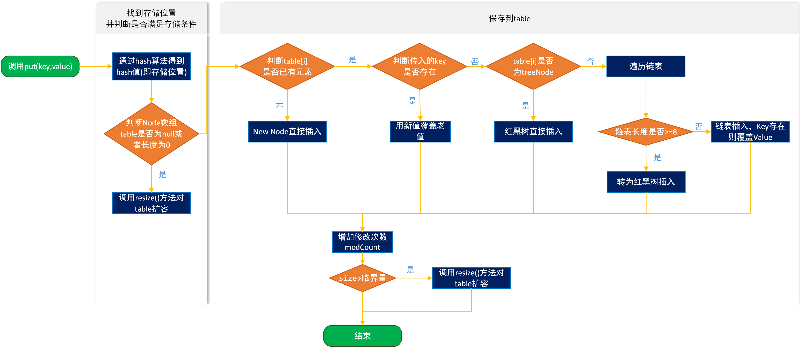

### 集合

[TOC]

#### 1. Java集合框架？

##### 介绍

- Map、Collection接口是所有集合框架的父类接口。

- Collection接口的子接口包括：Set和List接口；

- Map(**kv**)接口的实现类主要有：HashMap、TreeMap、HashTable、ConcurrentHashMap以及Propreties等。

- List(**有序可重复**)接口的实现类主要有：ArrayList、LinkedList、Vetor、Stack等。

- Set(**不可重复**)接口的实现类主要有：HashSet、TreeSet、LinkedHashSet等。

  


#### 2. HashMap原理？

##### 存储结构

​	采用**链表散列**的数据结构，即数组和链表组成的，当链表长度大于8，采用红黑树存储。

​	注意：初始容量为16，扩容方式为2N。

```java
/**
 * HashMap数据结构
 * "链表散列"的数据结构，内部实现是一个桶数组，每个桶中存放着一个单链表的头结点。
 *  链表长度大于8，采用红黑树存储。
 */
 static final float DEFAULT_LOAD_FACTOR = 0.75f;  // 默认负载因子！
 static final int DEFAULT_INITIAL_CAPACITY = 1 << 4; // aka 16   默认容量！

 transient Node<K,V>[] table; // extned Entry<K,V>
 transient int size;
 int threshold;			// 阈值 table.size * loadFactor
 final float loadFactor;

 // 计算hash
 static final int hash(Object key) {
    int h;
    return (key == null) ? 0 : (h = key.hashCode()) ^ (h >>> 16);
 }
 // 获得key索引
 tab[index = (tableSize - 1) & hash];

 // 大于阈值后，2倍扩容
 newCap = oldCap << 1
```

##### 常见问题

1. putVal逻辑？

   

2. 为什么容量总是2的次幂？

   索引位置计算公式： `tab[(n - 1) & hash]`。

   因为 n 永远是2的次幂，所以 n-1 通过 二进制表示，永远都是尾端以连续1的形式表示（00001111，00000011）。当(n - 1) 和 hash 做与运算时，会保留hash中 后 x 位的 1(且索引合法)，
   例如 00001111 & 10000011 = 00000011

   好处：

   - &(与)运算符比%(取模)运算速度快；
   - 能保证索引值不会超出长度；
   - 当n为2次幂时，满足公式：`(n - 1) & hash = hash % n`。

3. 为什么要自己计算hash?

   - 默认int类型的hashcode比起默认16的容量来说太大，map无法浪费计算资源和可能增加碰撞概率；
   - 可以满是公式：`(n - 1) & hash = hash % n`。

4. 为什么hash计算公式是`(key == null) ? 0 : (h = key.hashCode()) ^ (h >>> 16)`?

   实质上是把一个数的低16位和高16位做异或运算，因为前面计算索引公式，只有hash的低x位参与到运算。使高16位也参到hash的运算能减少hash冲突。

5. 为什么默认加载引子选择0.75？

   **提高空间利用率和减少查询成本的折中，主要是泊松分布，0.75的话碰撞最小。**

   加载因子过高，例如为1，虽然减少了空间开销，提高了空间利用率，但同时也增加了查询时间成本；

   加载因子过低，例如0.5，虽然可以减少查询时间成本，但是空间利用率很低，同时提高了rehash操作的次数。

6. HashMap扩容机制`resize()`？

   ```java
   final Node<K,V>[] resize() {
       Node<K,V>[] oldTab = table;
       int oldCap = (oldTab == null) ? 0 : oldTab.length;
       int oldThr = threshold;
       int newCap, newThr = 0;
       //以前的容量大于0，也就是hashMap中已经有元素了，或者new对象的时候设置了初始容量
       if (oldCap > 0) {
           //如果以前的容量大于限制的最大容量1<<30,则设置临界值为int的最大值2^31-1
           if (oldCap >= MAXIMUM_CAPACITY) {
               threshold = Integer.MAX_VALUE;
               return oldTab;
           }
           /**
            * 如果以前容量的2倍小于限制的最大容量，同时大于或等于默认的容量16，则设置临界值为以前临界值的2
            * 倍，因为threshold = loadFactor*capacity，capacity扩大了2倍，loadFactor不变，
            * threshold自然也扩大2倍。
            */
           else if ((newCap = oldCap << 1) < MAXIMUM_CAPACITY &&
                    oldCap >= DEFAULT_INITIAL_CAPACITY)
               newThr = oldThr << 1; // double threshold
       }
       /**
        * 在HashMap构造器Hash(int initialCapacity, float loadFactor)中有一句代码，this.threshold  	
        * = tableSizeFor(initialCapacity)， 表示在调用构造器时，默认是将初始容量暂时赋值给了
        * threshold临界值，因此此处相当于将上一次的初始容量赋值给了新的容量。什么情况下会执行到这句？当调用 	 
        * 了HashMap(int initialCapacity)构造器，还没有添加元素时
        */
       else if (oldThr > 0) 
           newCap = oldThr;
       /**
        * 调用了默认构造器，初始容量没有设置，因此使用默认容量DEFAULT_INITIAL_CAPACITY（16），临界值
        * 就是16*0.75
        */
       else {               
           newCap = DEFAULT_INITIAL_CAPACITY;
           newThr = (int)(DEFAULT_LOAD_FACTOR * DEFAULT_INITIAL_CAPACITY);
       }
       //对临界值做判断，确保其不为0，因为在上面第二种情况(oldThr > 0)，并没有计算newThr
       if (newThr == 0) {
           float ft = (float)newCap * loadFactor;
           newThr = (newCap < MAXIMUM_CAPACITY && ft < (float)MAXIMUM_CAPACITY ?
                     (int)ft : Integer.MAX_VALUE);
       }
       threshold = newThr;
       
       @SuppressWarnings({"rawtypes","unchecked"})
       /**构造新表，初始化表中数据*/
       Node<K,V>[] newTab = (Node<K,V>[])new Node[newCap];
       //将刚创建的新表赋值给table
       table = newTab;
       if (oldTab != null) {
           //遍历将原来table中的数据放到扩容后的新表中来
           for (int j = 0; j < oldCap; ++j) {
               Node<K,V> e;
               if ((e = oldTab[j]) != null) {
                   oldTab[j] = null;
                   //没有链表Node节点，直接放到新的table中下标为【e.hash & (newCap - 1)】位置即可
                   if (e.next == null)
                       newTab[e.hash & (newCap - 1)] = e;
                   //如果是treeNode节点，则树上的节点放到newTab中
                   else if (e instanceof TreeNode)
                       ((TreeNode<K,V>)e).split(this, newTab, j, oldCap);
                   //如果e后面还有链表节点，则遍历e所在的链表，
                   else { // 保证顺序
                       Node<K,V> loHead = null, loTail = null;
                       Node<K,V> hiHead = null, hiTail = null;
                       Node<K,V> next;
                       do {
                           //记录下一个节点
                           next = e.next;
                           /**
                            * newTab的容量是以前旧表容量的两倍,因为数组table下标并不是根据循环逐步递增
                            * 的，而是通过（table.length-1）& hash计算得到，因此扩容后，存放的位置就
                            * 可能发生变化，那么到底发生怎样的变化呢，就是由下面的算法得到.
                            *
                            * 通过e.hash & oldCap来判断节点位置通过再次hash算法后，是否会发生改变，如
                            * 果为0表示不会发生改变，如果为1表示会发生改变。到底怎么理解呢，举个例子：
                            * e.hash = 13 二进制：0000 1101
                            * oldCap = 32 二进制：0001 0000
                            *  &运算：  0  二进制：0000 0000
                            * 结论：元素位置在扩容后不会发生改变
                            */
                           if ((e.hash & oldCap) == 0) {
                               if (loTail == null)
                                   loHead = e;
                               else
                                   loTail.next = e;
                               loTail = e;
                           }
                           /**
                            * e.hash = 18 二进制：0001 0010
                            * oldCap = 16 二进制：0001 0000
                            * &运算：  16 二进制：0001 0000
                            * 结论：元素位置在扩容后会发生改变，那么如何改变呢？
                            * newCap = 32 二进制：0010 0000
                            * 通过(newCap-1)&hash
                            * 即0001 1111 & 0001 0010 得0001 0010，32+2 = 18
                            */
                           else {
                               if (hiTail == null)
                                   hiHead = e;
                               else
                                   hiTail.next = e;
                               hiTail = e;
                           }
                       } while ((e = next) != null);
                       if (loTail != null) {
                           loTail.next = null;
                           /**
                            * 若(e.hash & oldCap) == 0，下标不变，将原表某个下标的元素放到扩容表同样
                            * 下标的位置上
                            */
                           newTab[j] = loHead;
                       }
                       if (hiTail != null) {
                           hiTail.next = null;
                           /**
                            * 若(e.hash & oldCap) != 0，将原表某个下标的元素放到扩容表中
                            * [下标+增加的扩容量]的位置上 !!!
                            */
                           newTab[j + oldCap] = hiHead;
                       }
                   }
               }
           }
       }
       return newTab;
   }
   ```

   

7. 

8. HashMap在JDK1.7和1.8中区别？

   | 不同                     | JDK1.7                                                       | JDK1.8                                                       |
   | ------------------------ | ------------------------------------------------------------ | ------------------------------------------------------------ |
   | 存储结构                 | 数组+链表                                                    | 数组+链表+红黑树                                             |
   | 初始化方式               | 单独函数：`inflateTable()`                                   | 直接集成到了扩容函数`resize()`中                             |
   | hash值计算方式           | 扰动处理 = 9次扰动 = 4次位运算 + 5次异或运算                 | 扰动处理 = 2次扰动 = 1次位运算 + 1次异或运算                 |
   | 存放数据的规则           | 无冲突时，存放数组；冲突时，存放链表                         | 无冲突时，存放数组；冲突 & 链表长度 < 8：存放单链表；冲突 & 链表长度 > 8：树化并存放红黑树 |
   | 插入数据方式             | 头插法（先讲原位置的数据移到后1位，再插入数据到该位置）      | 尾插法（直接插入到链表尾部/红黑树）                          |
   | 扩容后存储位置的计算方式 | 全部按照原来方法进行计算（即hashCode ->> 扰动函数 ->> (h&length-1)） | 按照扩容后的规律计算（即扩容后的位置=原位置 or 原位置 + 旧容量） |

   

9. 

10. 。。

11. 。

12. 。

13. 。

14. 。

    

