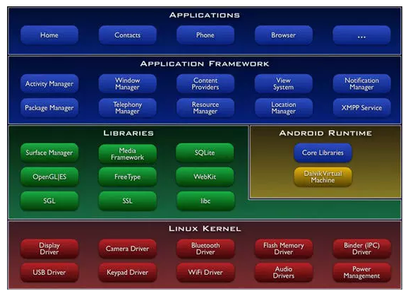
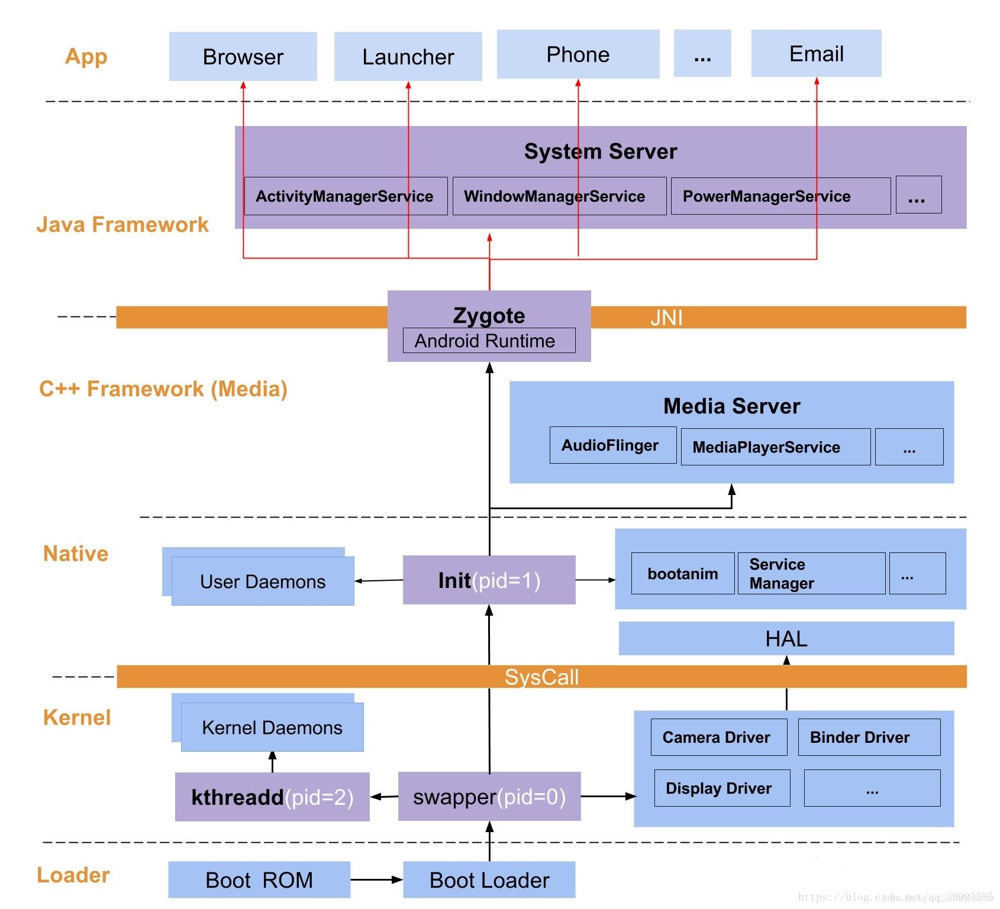
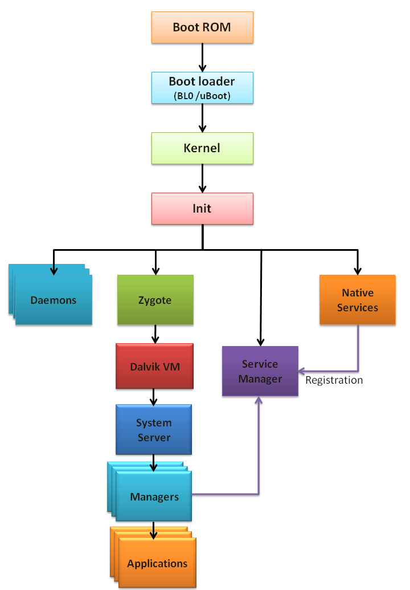
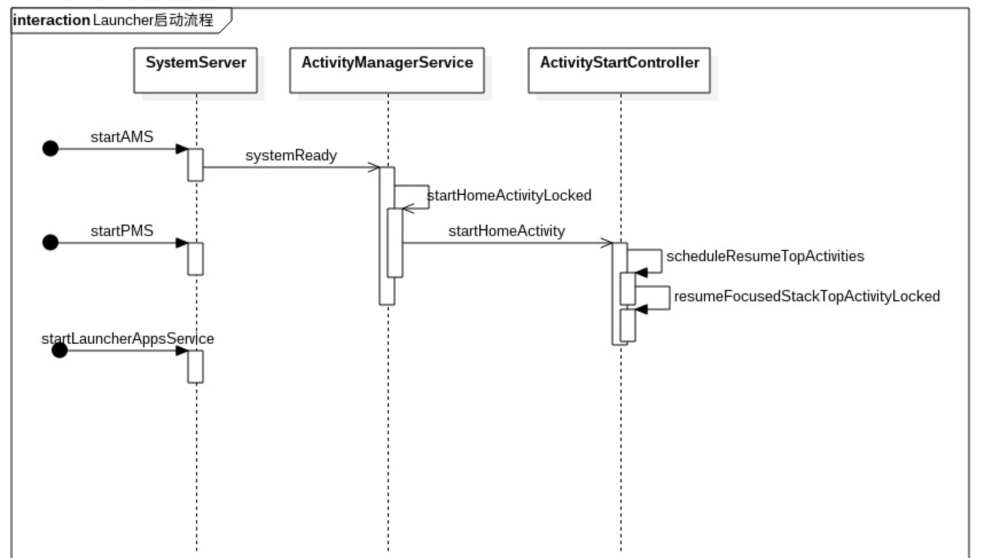
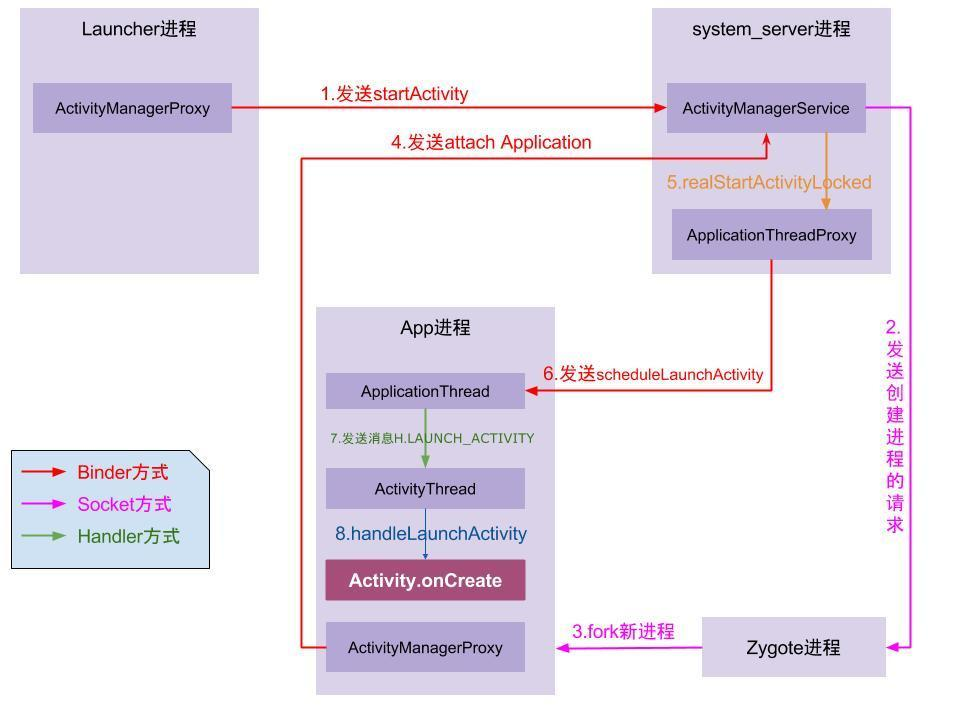
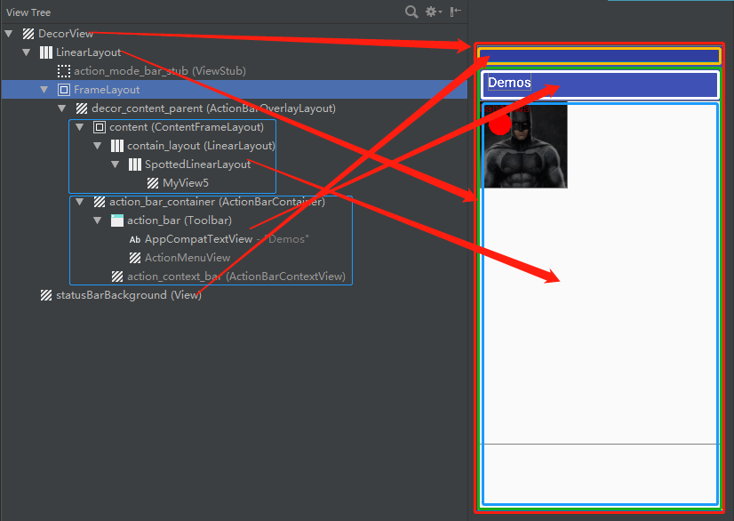

### Android基础

[TOC]

> Android 知识总结。
>

[参考1](https://www.jianshu.com/u/435577feb147)

[参考2](https://blog.csdn.net/jdsjlzx/article/details/97793159)







#### 1. Android系统架构？

采用分层架构思想，包括应用程序层、应用框架层、系统库和Android运行环境、linux内核。

- Jvm、Dalvik虚拟机、art虚拟机区别

  (1) Jvm基于栈，运行的是字节码文件，Jvm会为每一个类装载字节码；

  (2)Dalvik虚拟机:基于寄存器，运行dex字节码文件，一个应用程序对应一个Dalvik实例，独立运行；

   适应于低内存、低处理器的移动设备，依赖于linux内核。

  (3)Android4.4引入art虚拟机，**应用在第一次安装的时候，字节码就会预先编译成机器码，使其成为真正的本地应用，这个过程叫做预编译（AOT,Ahead-Of-Time）。**

  Dalvik每次都要编译再运行，Art只会首次启动编译；

  Art占用空间比Dalvik大（原生代码占用的存储空间更大），就是用“空间换时间”;

  Art减少编译，减少了CPU使用频率，使用明显改善电池续航;

  Art应用启动更快、运行更快、体验更流畅;

- 启动过程

  

#### 2. Launcher原理？

> Launcher是系统初始化后启动的第一个应用程序，负责展示系统中所有app到桌面，并进行响应。单单从应用角度来讲，Launcher是其他的应用一样，也是packages/apps/下面的一个apk。
>
> 主要包含： LauncherActivity、LauncherAppsService等

-  启动原理分析

  (1)系统启动时，Zygote进程fork出SystemServer进程，执行SystemServer.java类；

  (2)SystemServer会启动AMS、PMS以及其他service;

  (3)PMS解析本地应用，并把数据信息保存起来(包括launcher app)；

  (4)然后会启动SystemManager管理的一个服务LauncherAppsService,协助launcher管理本地package；

  (5)AMS触发systemReady(...)方法，其中执行了startHomeActivity(...)，这个方法最终会启动Launcher app.

  

- 例子

(1)单击桌面淘宝图标，Launcher通知AMS启动淘宝APP(清单文件中的入口类);
(2)AMS记录要启动的Activity信息，并且通知Launcher进入pause状态;
(3)Launcher进入pause状态后，通知AMS已经paused了，可以启动淘宝了;
(4)淘宝app未开启过，所以AMS启动新的进程，并且在新进程中创建ActivityThread对象，执行其中的main函数方法;
(5)淘宝app主线程启动完毕后通知AMS，并传入applicationThread以便通讯;
(6)AMS通知淘宝绑定Application并启动MainActivity;
(7)淘宝启动MainActivitiy，并且创建和关联Context,最后调用onCreate方法。

#### 3. Activity启动原理？

> 大致流程：Zygote fork APP进程->ActivityThread执行main方法(handler loop)->attach applicationThread->接收AMS消息。

- 核心类

  (1)ActivityThread：app入口类，主要就是做消息循环，一旦退出消息循环，那么你的程序也就可以退出了。
  从消息队列中取消息可能会阻塞，取到消息会做出相应的处理。如果某个消息处理时间过长，就可能会影响UI线程的刷新速率，造成卡顿的现象。

  (2)ApplicationThread:AT的成员变量，它就是作为服务端，接收ActivityManagerService的指令并执行.是ActivityThread与AMS连接的桥梁。

​        (3)final H mH = new H();   这个H是继承自Handler的,它是个私有的内部类，其实就是主线程的Handler，通  过这个Handler就可以往主线程的消息队列发消息如：启动Activity、service，接收广播等等,很多重要的工作.

   

#### 4. Handler原理？

[参考1](https://segmentfault.com/a/1190000019766810)

> 处理跨线程通讯问题。

- 为什么用handler？

  Android系统不允许在子线程更新UI的原因，本质上是**线程安全问题**，从而引出了handler。

  ```java
  final class AcitvityThread{
    public static void main(String[] args) {
    //创建Looper和MessageQueue对象，用于处理主线程的消息
     Looper.prepareMainLooper();
     //创建ActivityThread对象
     ActivityThread thread = new ActivityThread(); 
     //建立Binder通道 (创建新线程)
     thread.attach(false);
     Looper.loop(); //消息循环运行
     throw new RuntimeException("Main thread loop unexpectedly exited");
    }
  }
  ```

  

- 原理？

  1) 四个参与类： Message、MessageQueue、Looper、Handler。

  以主线程为例： 

  主线程执行ActivityMain.main方法时， 会默认调用`Looper.prepareMainLooper();`为当前线程创建一个Lopper对象(负责监视MQ)、MessageQueue对象(存储消息)，然后再调用`Looper.loop()`循环读队列；

  然后我们再主线程Activity创建Handler并重写handlerMessage()方法，Handler负责将Message发送至当前线程的MessageQueue中，looper取出message并分发给对应Handler的handlerMessage去处理。

- 设计知识点

  (1) 四个类的对应关系？

  Looper、MessageQueue是1:1关系，一个线程只能存在一组；

  new Handler(looper,callback)构造的时候与Looper产生关联，默认为当前线程looper；

  主线程初始化是默认创建并Looper、MessageQueue对象，并启动loop循环；子线程需要这样

  ```java
  public class ThreadHandlerActivity extends Activity{     
       //创建子线程
       class MyThread extends Thread{
           private Looper looper;//取出该子线程的Looper
           public void run() {
   
               Looper.prepare();//1. 创建该子线程的Looper
               looper = Looper.myLooper();//2. 取出该子线程的Looper
               Looper.loop();//3. 只要调用了该方法才能不断循环取出消息
           }
       }
   
       private Handler mHandler;//将mHandler指定轮询的Looper
       protected void onCreate(Bundle savedInstanceState) {
               super.onCreate(savedInstanceState);
               setContentView(R.layout.main);
               thread = new MyThread();
               thread.start();//千万别忘记开启这个线程
               //4. 下面是主线程发送消息(thread.looper!!!)
            mHandler = new Handler(thread.looper){
                public void handleMessage(android.os.Message msg) {
                  //5. 子线程执行
             Log.d("当前子线程是----->",Thread.currentThread()+"");
                   };
               };
               mHandler.sendEmptyMessage(1);
       }
   }
  ```

  (2) Message.obtain()原理？

  内部使用链表数据结构存储多个消息对象，最大长度为50，目的是为了重用Message对象。

  (3) 主线程中的Looper.loop()一直无限循环为什么不会造成ANR?

  造成ANR的原因有两种：

  1. 当前的事件没有机会得到处理（即主线程正在处理前一个事件，没有及时的完成或者looper被某种原因阻塞住了）；
  2. 前的事件正在处理，但没有及时完；

  原因：

  ActivityThread的main方法主要就是做消息循环一旦退出循环，那么应用就退出了；

  而且主线程Looper从消息队列读取消息，当读完所有消息时，主线程阻塞。子线程往消息队列发送消息，并且往管道文件写数据，主线程即被唤醒，从管道文件读取数据，主线程被唤醒只是为了读取消息，当消息读取完毕，再次睡眠。因此loop的循环并不会对CPU性能有过多的消耗。

  (4) 如何防止handler内存泄漏？

  将Handler声明为静态类，静态类不持有外部类的对象，所以Activity可以被随意回收。此处使用了弱引用WeakReference，也就是说当在内存不足时，系统会销毁弱/回收引用引用的对象，从而达到优化内存的目的。

  ```java
  public class Main4Activity extends AppCompatActivity {
      public static final int UPDATE = 0x1;
      TextView tv;
      @Override
      protected void onCreate(Bundle savedInstanceState) {
          super.onCreate(savedInstanceState);
          setContentView(R.layout.activity_main2);
          tv = (TextView) findViewById(R.id.tv);
          begin();//开启倒计时并跳转页面的方法
      }
      //Handler静态内部类
      private static class MyHandler extends Handler {
          //弱引用
          WeakReference<Main4Activity> weakReference;
          public MyHandler(Main4Activity activity) {
              weakReference = new WeakReference<Main4Activity>(activity);
          }
          @Override
          public void handleMessage(Message msg) {
              Main4Activity activity = weakReference.get();
              if (activity != null) {
                  activity.tv.setText(String.valueOf(msg.arg1));
              }
          }
      }
      private MyHandler handler = new MyHandler(this);
      public void begin() {
          new Thread(new Runnable() {
              @Override
              public void run() {
                      for (int i = 5; i > 0; i--) {
                          Message msg = new Message();
                          msg.what = UPDATE;
                          msg.arg1 = i;
                          handler.sendMessage(msg);
                          try {
                              Thread.sleep(1000);//休眠1秒
                          } catch (InterruptedException e) {
                              e.printStackTrace();
                          }
                          Log.i("tag", Main4Activity.this + "-" + i);
                      }
                      //计时结束后跳转到其他界面
                      startActivity(new Intent(Main4Activity.this, Main3Activity.class));
                      //添加finish方法在任务栈中销毁倒计时界面，使新开界面在回退时直接退出而不是再次返回该界面
                      finish();
                  }
          }).start();
      }
      @Override
      protected void onDestroy() {
          super.onDestroy();
          handler.removeCallbacksAndMessages(null);
          Log.i("tag", "destory");
      }
  }
  ```

#### 5. Binder机制原理？

> IPC是Inter-Process Communication的缩写，含义就是跨进程通信。
>
> Android系统中，每个应用程序是由Android的Activity，Service，Broadcast，ContentProvider这四大组件的中一个或多个组合而成，这四大组件所涉及的多进程间的通信底层都是依赖于Binder IPC机制。

[参考1](https://www.jianshu.com/p/b5cc1ef9f917)

[参考2](https://www.jianshu.com/p/b35e0716bce1)

[参考3](https://blog.csdn.net/nwpushuai/article/details/79662155)

#### 6. View的绘制流程和原理？

[参考1](https://www.cnblogs.com/andy-songwei/p/10955062.html)

- View绘制的三个流程

  (1)onMeasure(): 测量。系统会先根据xml布局文件和代码中对控件属性的设置，来获取或者计算出每个View和ViewGrop的尺寸，并将这些尺寸保存下来。

  (2)onLayout():布局。根据测量结果以及对应的参数，来确定每一个控件应该显示的位置。

  (3)onDraw():绘制。确认好位置后，就将这些控件绘制到屏幕上。

- View视图层级

  `Activity -> PhoneWindow - > DecorView  -> statusBar、（LinearLayout->FrameLayout->[content、titleBar]）。`

  

- 绘制过程

  ActivityThread(handlerResumeActivity方法)->WindowManagerImpl(addView方法)->WindowManagerGlobal(addView方法)->ViewRootImpl(prefromTraversals方法)。

  ```java
  
  // =====================ViewRootImpl.java=================
  private void performTraversals() {
     ......
     int childWidthMeasureSpec = getRootMeasureSpec(mWidth, lp.width);
     int childHeightMeasureSpec = getRootMeasureSpec(mHeight, lp.height);      
     ......
     // Ask host how big it wants to be
     performMeasure(childWidthMeasureSpec, childHeightMeasureSpec);
     ......
     performLayout(lp, mWidth, mHeight);
     ......
     performDraw();
  }
  ```

  

- Activity、Window、PhoneWindow、DecorVIew直接关系

  每个Activity都持有一个Window对象，但是Window都是一个抽象类，PhoneWindow是其唯一实现。也就是说Activity中的Window实例就是一个PhoneWindow对象。

  PhoneWindow对象持有一个非常重要的View对象DecorView。

  现在的关系就很明确了，每一个 Activity 持有一个 PhoneWindow 的对象，而一个 PhoneWindow 对象持有一个 DecorView 的实例，**所以 Activity 中 View 相关的操作其实大都是通过 DecorView 来完成**。

- ..

#### 7. 事件传递机制？

- 事件分发三对象：

  Activity:接受Down点击事件，传递给PhoneWindow和DecorView；

  ViewGroup：拦截事件，或者继续传递事件给子View；

  View：决定消费这个事件或者不消费从而返回给上一级。

- 事件分发三个方法：

  (1)dispatchTouchEvent()：分发(传递)点击事件，当单击事件传递给当前View时，该方法就会被调用，return false 事件停止向子View传递和分发；

  (2)onTouchEvent(): 处理点击事件， 在dispatch方法内部调用，return false是不消费事件，并让事件往父控件方向流动，return ture是消费事件；

  (3)onInterceptTouchEvent() 判断是否拦截了某个事件，**只存在于ViewGroup，普通View无该方法**，在ViewGroup的dispatch内部调用。 return false是不拦截事件，允许事件向子View传递，return true是拦截事件，不在向子View传递事件。

#### 8. 屏幕适配

- 屏幕适配发展

  (1) dp直接适配

  利用dp + 自适应布局 + weight 实现；

  缺点：dpi的不同存在一些差异，特殊手机需要单独适配，要将px转dp。

  (2)宽高限定符适配

  利用values-480$\times$320,values-1280$\times$720实现；

  确定：需要精准命中；

  (3)UI适配框架Autolayout

  核心功能就是在绘制的时候在onMeasure里面做变换，重新计算px；

  确定：有些自定义控件需要单独适配，不可靠。

- 最好的适配方案

  (1)SmallestWidth适配(sw限定符适配)

  利用屏幕宽度dp，然后识别不同的资源文件。values-sw360dp。它有较好的容错机制，找不到找一个最接近的资源文件。

  缺点：apk变大；

  利用：  设计师按宽度为 375px设计界面， 在360dp文件夹中 1px=0.96dp、375px=360dp;

   xml直接以px为单位就像了。

#### 名词解释

| 类名                 | 作用                                                         |
| -------------------- | ------------------------------------------------------------ |
| **Init进程**         | 系统内核启动完成后，就会创建用户空间的第一个进程；后面所有的进程，都是它孵化出来的。 |
| **Zygote进程**       | 是系统创建新进场的核心，在init进程启动后就会创建zygote进程；zygote进程在内部会先启动Dalvik虚拟机，继而加载一些必要的系统资源和系统类，最后进入一种监听状态。在之后的运作中，当其他系统模块（比如AMS）希望创建新进程时，只需向zygote进程发出请求，zygote进程监听到该请求后，会相应地fork出新的进程，于是这个新进程在初生之时，就先天具有了自己的Dalvik虚拟机以及系统资源 |
| **SystemServer进程** | 并称**Android世界的三极。**SS是由Zygote通过Zygote.forkSystemServer函数fork诞生出来的。与Zygote生死与共.SS诞生后,便和生父Zygote分道扬镳,它有了自己的历史使命。即加载各种Service()。<br />作用:<br />init1()是native函数,启动了 c++运行时库,如：sqllite,OpenGL ES等,然后把调用线程加入Binder通信中。<br />init2在Java层,就是单独创建一个线程,用以启动系统各项服务,如：ActivityManagerService,PowerManagerService...注意这些服务都是线程,在SystemServer进程中. |
| **AcitvityThread**   | 它的main方法，是整个应用程序的入口，管理者四大组件。         |
|                      |                                                              |
|                      |                                                              |

