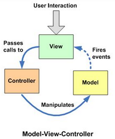
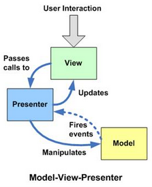
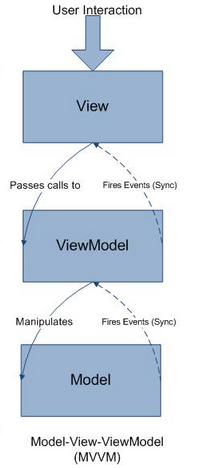

### 架构

[TOC]

#### 1. 概述

​	什么是架构，每个人可能都有自己的理解，我比较喜欢的定义是：“架构是系统的**组成部分**及其**之间的关系**。”根据观察者的视角不同，架构又分为业务架构和技术架构。一般来说，功能性需求对业务架构产生影响，而非功能性需求会对技术架构产生影响。

​	架构体现的是对复杂系统的分解设计。而如何进行分解，则是软件设计领域永恒的话题。

​	良好的架构，必须遵循的最重要的原则是**分离关注点(Separation of concerns, SoC)**，这样可以产生高内聚、低耦合的系统，这是美丽架构的终极原则。

​	常见的分层思想：MVC、纵向分离、横向分离、切面分离、依赖方向分离、关注数据分离、关注行为分离、扩展分离、委托分离、反转分离等。

#### 2. MVC

##### 1. 工作原理

​	

1. View接受用户的交互请求；
2. View将请求转发给Controller；
3. Controller操作Model进行数据更新；
4. 数据更新后，Model通知View数据变化；
5. View显示更新之后的数据。

##### 2. 优点

1. 实现了解耦合，修改其中一层代码，不影响其他两层。

##### 3. 缺点(Android)

1. Model和View之间直接交互，必然会导致耦合。

2. 所有逻辑代码都写在Controller中，导致特别臃肿。

   **针对Android问题：**

   1. Keep It Stupid Simple(The Kiss Principle)

   - Most of the modern Android applications just use View-Model architecture.

   - Programmers are involved into fight with View complexities instead of solving business tasks.

     早期android采用view-model模式，所有的代码都写在activity中(everything is connected with everything)，代码复杂难以维护，且开发者大部分时间在处理复杂的UI而不是业务逻辑，且容易导致内存泄漏。

##### 4. 适应场景

​	适用于较小，功能较少，业务逻辑较少的项目。

#### 3. MVP

##### 1. 工作原理



1. View接受用户交互请求；
2. View将请求转交给Presenter；
3. Presenter操作Model进行数据更新；
4. 数据更新后，Model通知Presenter数据发送变化；
5. Presenter更新View的数据；

##### 2. 优点

1. 分离View和Model，代码易于维护、扩展、测试；
2. View可组件化，复用；
3. P层可以持久化数据，防止activity重启引起的重复请求或内存泄漏(频繁横竖屏)，例如oncreate的时候请求数据，然后频繁横竖屏;

##### 3. 缺点

1. 维护比较困难

   Presenter中除了业务逻辑以外，还有大量的View-Model，Model-View的手动同步逻辑，造成Presenter比较笨重，维护起来困难。

##### 4. 使用场景

​	视图界面不是很多特别复杂的项目。

##### 5. 常见的几种实现框架

1. 普通实现(接口实现)

   ```java
   // MainActivity
   public class MainActivity extends Activity implements IUserInfoShow {
       private UserInfoPresenter mUserInfoPresenter;
       @Override
       protected void onCreate(Bundle savedInstanceState) {
           super.onCreate(savedInstanceState);
           setContentView(R.layout.activity_main);
           mUserInfoPresenter = new UserInfoPresenter(this, new GetUserInfoImpl());
           mUserInfoPresenter.getUserInfo(123);
       }
       @Override
       public void beforeLoding() {
           Log.i(TAG, "beforeLoding");
       }
     	...
   }
   // Presenter
   public class UserInfoPresenter {
       private IGetUserInfo mIGetUserInfo;
       private IUserInfoShow mUserInfoShow;
       public UserInfoPresenter(IUserInfoShow mUserInfoShow, IGetUserInfo mIGetUserInfo) {
           this.mUserInfoShow = mUserInfoShow;
           this.mIGetUserInfo = mIGetUserInfo;
       }
       public void getUserInfo(int id){
           mUserInfoShow.beforeLoding();
           mIGetUserInfo.getUserInfo(id, new OnUserInfoListener() {
               @Override
               public void getUserInfoSuccess(User user) {
                   mUserInfoShow.getUserInfoSucceed(user);
                   mUserInfoShow.afterLoading();
               }
               @Override
               public void getUserInfoFailure(String msg) {
                   mUserInfoShow.getUserInfoFailed(msg);
                   mUserInfoShow.afterLoading();
               }
           });
       }
   }
   ```

   

2. Base类实现

   ...

#### 4. MVVM

##### 1. 工作原理



​	MVVM是在原有领域Model的基础上添加一个ViewModel，这个ViewModel除了正常的属性意外，还包括一些供View显示用的属性。例如在经典的MVP中，view有一个属性ischeck，需要在presenter中设置view的ischeck值。但是在MVVM中的presenter也会有一个ischeck属性来同步view的ischeck属性，可能会用到observer模式同步ischeck的值。在MVVM中，presenter被改名为ViewModel，就演变成了你看到的MVVM。在支持双向绑定的平台，MVVM更受欢迎。例如：微软的WPF和Silverlight。

##### 2. 优点

1. 提高了可维护性

   解决了MVP大量的手动View和Model同步的问题，提供双向绑定机制。提高了代码的可维护性。

2. 简化测试

   因为同步逻辑是交由Binder做的，View跟着Model同时变更，所以只需要保证Model的正确性，View就正确。大大减少了对View同步更新的测试。

3. ViewMode易于单元测试

##### 3. 缺点

	1. MVVM的问题呢，其实和MVC有一点像。data binding框架解决了数据绑定的问题，但是view层还是会过重，大家可以看我上面那个MVVM模式下的activity；
 	2. 对于大型的图形应用程序，视图状态较多，ViewModel的构建和维护的成本都会比较高；
 	3. 数据绑定的声明是指令式地写在View的模版当中的，这些内容是没办法去打断点debug的；
 	4. 目前这种架构方式的实现方式比较不完善规范，常见的就是DataBinding框架。

##### 4. 使用场景

​	使用于界面展示数据较多的项目。

##### 5. 常见的几种实现框架

1. mvp+databinding实现

   

#### 5. Jetpack

##### 1. 工作原理


> **[`ViewModel`](https://developer.android.google.cn/topic/libraries/architecture/viewmodel)** 对象为特定的界面组件（如 Fragment 或 Activity）提供数据，并包含数据处理业务逻辑，以与模型进行通信。例如，`ViewModel` 可以调用其他组件来加载数据，还可以转发用户请求来修改数据。`ViewModel` 不了解界面组件，因此不受配置更改（如在旋转设备时重新创建 Activity）的影响。


- 参考

[1. KISS](https://people.apache.org/~fhanik/kiss.html)

[2. MVP](https://blog.csdn.net/bat1992/article/details/54378721)

[3. 框架区别](https://www.cnblogs.com/aademeng/articles/6773178.html)