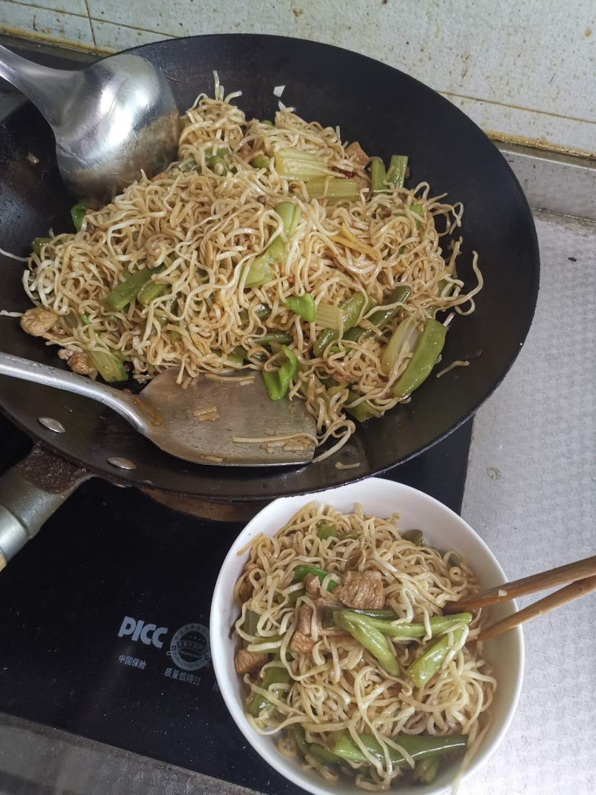

### 自己动手做美食

[TOC]

> 作为一个地道的北方人，还是比较喜欢吃面食。由于排行是家里老小，宝贝疙瘩，在家从没有自己做过饭，可为人又有点好吃，所以自己动手做自己的美食食谱吧！

#### 1. 豆角焖面

##### 食材准备

​	主食：切面1斤(4人份)；五花肉半斤；豆角半斤；芹菜1根；青椒1根；

​	调料：大葱一段、大蒜3斑、姜、干辣椒3个、大茴香1颗、花椒8粒、胡椒粉、盐、生抽、老抽、耗油、料酒；

##### 流程

1. 蒸面：切面撕成10厘米左右，加入少量食用油，拌开，这样防止面条黏连；篦子上放一张打湿的笼布，放上面条，蒸锅水开后，放入篦子，大火蒸8分钟。

   面条蒸好后，用筷子挑散。

2. 准备配菜：

   - 豆角、芹菜择成小段；青椒切成小片；肉切成肉丝；
   - 切姜丝、葱片、蒜片和干辣椒、大茴香、花椒放入碗中备用；

3. 开炒

   - 油锅烧热，倒入食用油(比平时多一点)，倒入肉丝翻炒，炒制发白是放入葱姜蒜，翻炒出香味；
   - 然后倒入豆角、芹菜翻炒，翻炒均匀后开始调味，放入盐、老抽调色、生抽调味、料酒去腥增香、少量耗油和胡椒粉，翻炒均匀；
   - 加水与菜持平，盖上锅盖煮5分钟；水开后，盛出一碗汤汁备用，然后放入面条，浇上汤汁，盖上锅盖焖6分钟，改用小火；
   - 打开锅盖，加入青椒(蒜片)，把面条和菜挑开均匀，关火等2分钟即可。

**如图：**

