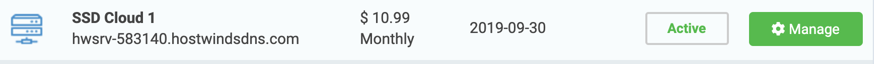
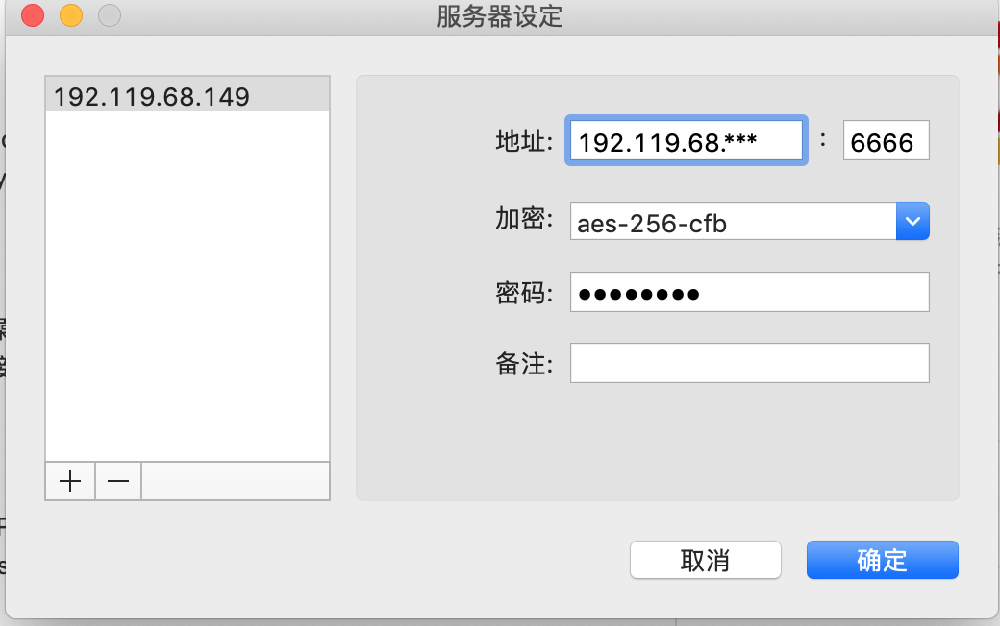

# VPS安装教程

### VPS购买

亲测推荐使用[hostwinds](https://www.hostwinds.com/),一个月10.99刀；配置ssh方便远程登录。结果如图：



### 安装shadowsocks服务(centos7.4)

#### 配置epel源，安装python-pip

```shell
wget -O /etc/yum.repos.d/epel.repo http://mirrors.aliyun.com/repo/epel-7.repo
yum install python-pip
pip install --upgrade pip
```

#### 安装shadowsocks

```
pip install shadowsocks
```

#### 创建配置文件

```shell
mkdir /etc/shadowsocks
vi /etc/shadowsocks/shadowsocks.json
```

添加内容

```json
{
    "server":"192.119.68.***",  代理服务器的IP
    "server_port":6666,         端口
    "local_address": "127.0.0.1",
    "local_port":1080,
    "password":"password",      密码
    "timeout":300,
    "method":"aes-256-cfb",
    "fast_open": false,
    "workers": 1
}
```

#### 启动shadowsocks客户端

```shell
ssserver -c /etc/shadowsocks/shadowsocks.json -d start  
ssserver -c /etc/shadowsocks/shadowsocks.json -d stop
```

#### 验证

验证shadowsocks客户端是否正常运行，正常会返回你的代理IP

```shell
curl --socks5 127.0.0.1:1080 http://httpbin.org/ip
curl www.google.com
```

#### Mac使用

安装小飞机客户端，添加服务，如何连接就可以访问gg了。



